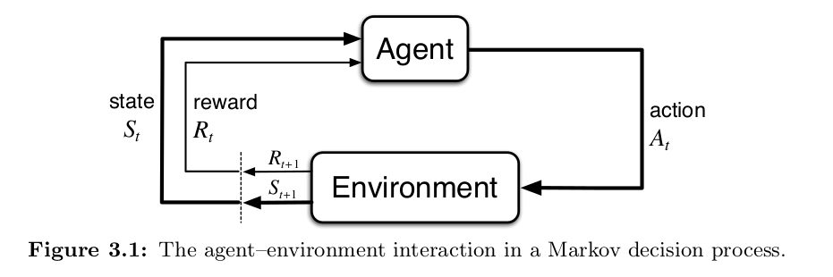

## Key concepts
- Reinforcement learning is learning how to act through interaction with the environment.
- 4 main elements of RL:
    - Policy: the agent's behavior rule: what action to take in each situation
    - Reward signal: immediate feedback from environment, defines the goal of the RL problem
    - Value function: estimate of long-term goodness of actions or states, used to evaluate the policy
    - Model: a prediction of how the environment will respond to actions.

## Finite Markov Decision Processes (MDPs)
- A MDP is a mathematical framework for modeling sequential decision making problems in which an agent interacts with an environment by observing states, taking actions, receiving rewards, and transitioning to new states, with the key assumption that the future depends only on th current state and action, not on the past history.

- Return $G_t$ is the total discounted reward from time step $t$, defined as $G_t = R_{t+1} + \gamma R_{t+2} + \gamma^2 R_{t+3} + ... = \sum_{k=0}^{\infty} \gamma^k R_{t+k+1}$, where $\gamma$ is the discount factor that determines the importance of future rewards.
- The value function $v_\pi(s)$ is the expected return when starting in state $s$ and following policy $\pi$, defined as $v_\pi(s) = \mathbb{E}_\pi[G_t | S_t = s]$.
- The action-value function $q_\pi(s, a)$ is the expected return when starting in state $s$, taking action $a$, and thereafter following policy $\pi$, defined as $q_\pi(s, a) = \mathbb{E}_\pi[G_t | S_t = s, A_t = a]$.

- Some relationships:
    - $v_\pi(s) = \sum_{a} \pi(a|s) q_\pi(s, a)$
    - $q_\pi(s, a) = \sum_{s', r} p(s', r | s, a) [r + \gamma v_\pi(s')]$

- Bellman equation:
    - For value function: $v_\pi(s) = \sum_{a} \pi(a|s) \sum_{s', r} p(s', r | s, a) [r + \gamma v_\pi(s')]$
    - For action-value function: $q_\pi(s, a) = \sum_{s', r} p(s', r | s, a) [r + \gamma \sum_{a'} \pi(a'|s') q_\pi(s', a')]$

- For finite MDPs, there's always at least one policy that is better than or equal to all other policies. This is called the optimal policy $\pi^*$, and it satisfies $v_{\pi^*}(s) \geq v_\pi(s)$ for all policies $\pi$ and states $s$. (need to prove)

- Bellman optimal equation:
    - $ v_*(s)=\max_{a\in\mathcal{A}(s)}\sum_{s'\in\mathcal{S}}\sum_{r\in\mathcal{R}}p(s',r\mid s,a)\left[r+\gamma v_*(s')\right]$
    - $q_*(s,a)=\sum_{s'\in\mathcal{S}}\sum_{r\in\mathcal{R}}p(s',r\mid s,a)\left[r+\gamma\max_{a'\in\mathcal{A}(s')}q_*(s',a')\right]$

## Dynamic Programming

### Policy Iteration using iterative policy evaluation, for estimating $\pi \approx \pi_*$

#### 1. Initialization

$V(s) \in \mathbb{R}$ and $\pi(s) \in \mathcal{A}(s)$ arbitrarily for all $s \in \mathcal{S}$;  
$V(\text{terminal}) = 0$

---

#### 2. Policy Evaluation

**Loop:**

- $\Delta \leftarrow 0$

- For each $s \in \mathcal{S}$:

    - $v \leftarrow V(s)$

    - $V(s) \leftarrow \sum_{s', r} p(s', r \mid s, \pi(s))\left[r + \gamma V(s')\right]$

    - $\Delta \leftarrow \max(\Delta, |v - V(s)|)$

until $\Delta < \theta$, a small positive number determining the accuracy of estimation

---

#### 3. Policy Improvement

$\text{policy-stable} \leftarrow \text{true}$

For each $s \in \mathcal{S}$:

- $\text{old-action} \leftarrow \pi(s)$

- $\pi(s) \leftarrow \arg\max_a \sum_{s', r} p(s', r \mid s, a)\left[r + \gamma V(s')\right]$

- If $\text{old-action} \neq \pi(s)$, then  $\text{policy-stable} \leftarrow \text{false}$

If $\text{policy-stable}$, then stop and return $V \approx v_*$ and $\pi \approx \pi_*$;  else go to **2. Policy Evaluation**.

### Value Iteration, for estimating $\pi \approx \pi_*$

**Algorithm parameter:** a small threshold $\theta > 0$ determining accuracy of estimation  

Initialize $V(s)$, for all $s \in \mathcal{S}^+$, arbitrarily except that $V(\text{terminal}) = 0$

**Loop:**

- $\Delta \leftarrow 0$

- For each $s \in \mathcal{S}$:

    - $v \leftarrow V(s)$

    - $V(s) \leftarrow \max_a \sum_{s', r} p(s', r \mid s, a)\left[r + \gamma V(s')\right]$

    - $\Delta \leftarrow \max(\Delta, |v - V(s)|)$

until $\Delta < \theta$

Output a deterministic policy, $\pi \approx \pi_*$, such that $\pi(s) = \arg\max_a \sum_{s', r} p(s', r \mid s, a)\left[r + \gamma V(s')\right]$
## Appendix
Let $(T_* v)(s)=\max_{a\in A(s)} \sum_{s',r} p(s',r|s,a),[r+\gamma v(s')]$\
and $(T_\pi v)(s)=\sum_a \pi(a|s) \sum_{s',r} p(s',r|s,a),[r+\gamma v(s')]$

### Prove that value iteration converges to the optimal value function $v_*$
For any 2 value functions u,v $$\|T_*u - T_*v\|_\infty \le \gamma \|u - v\|_\infty$$
Here, $\|.\|_\infty$ denotes the infinity norm, $\|u\|_\infty = \max_{s \in S} |u(s)|$

At the optimal value we have $v_* = T_* v_*$ (Bellman optimal equation)

Value iteration uses the update: $v_{k+1}(s) = T_* v_k$ thus:
$$\|v_{k+1} - v_*\|_\infty = \|T_*v_{k} - T_*v_*\|_\infty \le \gamma \|v_k - v_*\|_\infty = \gamma^k \|v_0 - v_*\|_\infty$$

Since $0\leq \gamma < 1 $, $\gamma ^k \to 0$, therefore: $v_k \to v_*$ when $k \to \infty$

### Prove that policy evaluation converges to the optimal function
Similar to value iteration

