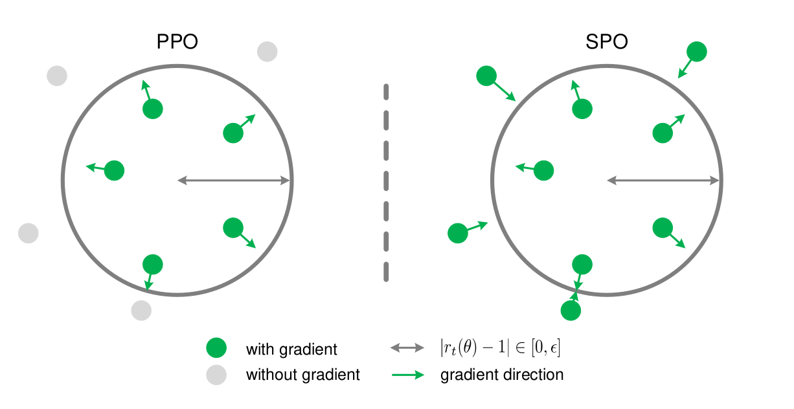

Objective: Learn a policy

The main idea of policy gradient methods is to directly optimize the policy by maximizing the performance measure $J(\theta)$. 

We update $\theta$ in $\pi(a|s,\theta)$ to maximize the performance measure $J(\theta)$ using
$$\theta_{t+1} = \theta_t + \alpha \nabla J(\theta_t)$$

What is $J(\theta)$? It can be the expected return, the discounted expected return (in episodic
cases), or the average reward (in continuing cases) from the initial state.

Using the policy gradient theorem, we can get the general form of $\nabla J(\theta)$ as follows:
$$\nabla J(\theta) \propto \sum_{s}\mu(s)\sum_{a}\nabla\pi_{\theta}(a|s)Q^{\pi}(s,a)$$
where $\mu(s)$ is the state distribution under policy $\pi$, defined as $\mu(s) = \mathbb{E}_t [P(s_{t}=s|\pi)]$, and denotes the fraction of time that the agent spends in state $s$ while following policy $\pi$. In discounted-state cases, $\mu(s) = \mathbb{E}_t [\gamma^t P(s_t=s|\pi)]$.

But $\nabla J(\theta) \propto \sum_{s}\mu(s)\sum_{a}\nabla\pi_{\theta}(a|s)Q^{\pi}(s,a)$ is computationally expensive to calculate or cannot be calculated directly when the state and action spaces are continuous, so we can express it as follows:
$$\nabla J(\theta) \propto \sum_{s}\mu(s)\sum_{a}\pi_{\theta}(a|s)\nabla\log\pi_{\theta}(a|s)Q^{\pi}(s,a) = \mathbb{E}_{s,a}[\nabla\log\pi_{\theta}(a|s)Q^{\pi}(s,a)]$$

In general, the methods discussed below address two questions:
- How good or bad was the sampled action?
    - REINFORCE, baseline, advantage, baseline, TD error, GAE
- Once we know whether the action was good or bad, how strongly should we change the policy?
    - TRPO, PPO

This note will focus on the second question, which is how to update the policy. We will discuss two methods: TRPO and PPO.

In policy gradient methods, the general process is:
- Sample a trajectory using the current policy $\pi_{\theta}$.
- Use the sampled trajectory to estimate the return $R_t$ or advantage $A_t$.
- Update the policy using the estimated return or advantage.

The problem is: we use data from the old policy to update the new policy, but if the policy changes too much, the data from the old policy may not be useful for the new policy. So we need to constrain the policy update to ensure that the new policy is not too different from the old policy.

# TRPO Theorem
# 2 Preliminaries

Consider an infinite-horizon discounted Markov decision process (MDP), defined by the tuple $(\mathcal{S}, \mathcal{A}, P, r, \rho_0, \gamma)$, where $\mathcal{S}$ is a finite set of states, $\mathcal{A}$ is a finite set of actions, $P:\mathcal{S}\times\mathcal{A}\times\mathcal{S}\rightarrow\mathbb{R}$ is the transition probability distribution, $r:\mathcal{S}\rightarrow\mathbb{R}$ is the reward function, $\rho_0:\mathcal{S}\rightarrow\mathbb{R}$ is the distribution of the initial state $s_0$, and $\gamma\in(0,1)$ is the discount factor.

Let $\pi$ denote a stochastic policy $\pi:\mathcal{S}\times\mathcal{A}\rightarrow[0,1]$, and let $\eta(\pi)$ denote its expected discounted reward:

$$ \eta(\pi)=\mathbb{E}_{s_0,a_0,\ldots}\left[\sum_{t=0}^{\infty}\gamma^t r(s_t)\right], \quad \text{where } s_0\sim\rho_0(s_0),\; a_t\sim\pi(a_t|s_t),\; s_{t+1}\sim P(s_{t+1}|s_t,a_t). $$

We will use the following standard definitions of the state-action value function $Q_\pi$, the value function $V_\pi$, and the advantage function $A_\pi$:

$$ Q_\pi(s_t,a_t)=\mathbb{E}_{s_{t+1},a_{t+1},\ldots}\left[\sum_{l=0}^{\infty}\gamma^l r(s_{t+l})\right], $$

$$ V_\pi(s_t)=\mathbb{E}_{a_t,s_{t+1},\ldots}\left[\sum_{l=0}^{\infty}\gamma^l r(s_{t+l})\right], $$

$$ A_\pi(s,a)=Q_\pi(s,a)-V_\pi(s), \quad \text{where } a_t\sim\pi(a_t|s_t),\; s_{t+1}\sim P(s_{t+1}|s_t,a_t) \text{ for } t\ge0. $$

The following useful identity expresses the expected return of another policy $\tilde{\pi}$ in terms of the advantage over $\pi$, accumulated over timesteps (see Kakade & Langford (2002) or Appendix A for proof):

$$ \eta(\tilde{\pi})=\eta(\pi)+\mathbb{E}_{s_0,a_0,\ldots\sim\tilde{\pi}}\left[\sum_{t=0}^{\infty}\gamma^t A_\pi(s_t,a_t)\right]. \tag{1} $$

where the notation $\mathbb{E}_{s_0,a_0,\ldots\sim\tilde{\pi}}[\cdot]$ indicates that actions are sampled $a_t\sim\tilde{\pi}(\cdot|s_t)$.

Let $\rho_\pi$ be the (unnormalized) discounted visitation frequencies,

$$ \rho_\pi(s)=P(s_0=s)+\gamma P(s_1=s)+\gamma^2P(s_2=s)+\cdots, $$

where $s_0\sim\rho_0$ and the actions are chosen according to $\pi$. We can rewrite Equation 1 with a sum over states instead of timesteps:

$$ \eta(\tilde{\pi})=\eta(\pi)+\sum_s\rho_{\tilde{\pi}}(s)\sum_a\tilde{\pi}(a|s)A_\pi(s,a). \tag{2} $$

This equation implies that any policy update $\pi\rightarrow\tilde{\pi}$ that has a nonnegative expected advantage at every state, i.e. $\sum_a \tilde{\pi}(a|s)A_\pi(s,a)\ge0$, is guaranteed to increase the policy performance $\eta$, or leave it constant in the case that the expected advantage is zero everywhere. This implies the classic result that the update performed by exact policy iteration, which uses the deterministic policy $\tilde{\pi}(s)=\arg\max_a A_\pi(s,a)$, improves the policy if there is at least one state-action pair with a positive advantage value and nonzero state visitation probability, otherwise the algorithm has converged to the optimal policy. However, in the approximate setting, it will typically be unavoidable, due to estimation and approximation error, that there will be some states $s$ for which the expected advantage is negative, that is, $\sum_a \tilde{\pi}(a|s)A_\pi(s,a)<0$. The complete dependency of $\rho_{\tilde{\pi}}(s)$ on $\tilde{\pi}$ makes Equation 2 difficult to optimize directly. Instead, we introduce the following local approximation to $\eta$:

$$ L_\pi(\tilde{\pi})=\eta(\pi)+\sum_s\rho_\pi(s)\sum_a\tilde{\pi}(a|s)A_\pi(s,a). \tag{3} $$

Note that $L_\pi$ uses the visitation frequency $\rho_\pi$ rather than $\rho_{\tilde{\pi}}$, ignoring changes in state visitation density due to changes in the policy. However, if we have a parameterized policy $\pi_\theta$, where $\pi_\theta(a|s)$ is a differentiable function of the parameter vector $\theta$, then $L_{\pi_{\theta_0}}$ matches $\eta$ to first order (see Kakade & Langford (2002)). That is, for any parameter value $\theta_0$,

$$ L_{\pi_{\theta_0}}(\pi_{\theta_0})=\eta(\pi_{\theta_0}), $$

$$ \nabla_\theta L_{\pi_{\theta_0}}(\pi_\theta)\big|_{\theta=\theta_0}=\nabla_\theta\eta(\pi_\theta)\big|_{\theta=\theta_0}. \tag{4} $$

Equation (4) implies that a sufficiently small step $\pi_{\theta_0}\rightarrow\tilde{\pi}$ that improves $L_{\pi_{\theta_0}}$ will also improve $\eta$, but does not give us any guidance on how big of a step to take.

To address this issue, Kakade & Langford (2002) proposed a policy updating scheme called conservative policy iteration, for which they could provide explicit lower bounds on the improvement of $\eta$. To define the conservative policy iteration update, let $\pi_{\text{old}}$ denote the current policy, and let $\pi'=\arg\max_{\pi'}L_{\pi_{\text{old}}}(\pi')$. The new policy $\pi_{\text{new}}$ was defined to be the following mixture:

$$ \pi_{\text{new}}(a|s)=(1-\alpha)\pi_{\text{old}}(a|s)+\alpha\pi'(a|s). \tag{5} $$

Kakade and Langford derived the following lower bound:

$$ \eta(\pi_{\text{new}})\ge L_{\pi_{\text{old}}}(\pi_{\text{new}})-\frac{2\epsilon\gamma}{(1-\gamma)^2}\alpha^2 \quad \text{where } \epsilon=\max_s\left|\mathbb{E}_{a\sim\pi'(\cdot|s)}[A_\pi(s,a)]\right|. \tag{6} $$

(We have modified it to make it slightly weaker but simpler.) Note, however, that so far this bound only applies to mixture policies generated by Equation (5). This policy class is unwieldy and restrictive in practice, and it is desirable for a practical policy update scheme to be applicable to all general stochastic policy classes.

# 3 Monotonic Improvement Guarantee for General Stochastic Policies

Equation (6), which applies to conservative policy iteration, implies that a policy update that improves the right-hand side is guaranteed to improve the true performance $\eta$. Our principal theoretical result is that the policy improvement bound in Equation (6) can be extended to general stochastic policies, rather than just mixture policies, by replacing $\alpha$ with a distance measure between $\pi$ and $\tilde{\pi}$, and changing the constant appropriately. Since mixture policies are rarely used in practice, this result is crucial for extending the improvement guarantee to practical problems. The particular distance measure we use is the total variation divergence, which is defined by $D_{TV}(p\|q)=\frac12\sum_i|p_i-q_i|$ for discrete probability distributions $p,q$. Define

$$ D_{TV}^{\max}(\pi,\tilde{\pi})=\max_s D_{TV}\left(\pi(\cdot|s)\|\tilde{\pi}(\cdot|s)\right). \tag{7} $$

**Theorem 1.** Let $\alpha=D_{TV}^{\max}(\pi_{\text{old}},\pi_{\text{new}})$. Then the following bound holds:

$$ \eta(\pi_{\text{new}})\ge L_{\pi_{\text{old}}}(\pi_{\text{new}})-\frac{4\epsilon\gamma}{(1-\gamma)^2}\alpha^2 \quad \text{where } \epsilon=\max_{s,a}|A_\pi(s,a)|. \tag{8} $$

We provide two proofs in the appendix. The first proof extends Kakade and Langford's result using the fact that the random variables from two distributions with total variation divergence less than $\alpha$ can be coupled, so that they are equal with probability $1-\alpha$. The second proof uses perturbation theory.

Next, we note the following relationship between the total variation divergence and the KL divergence (Pollard, 2000, Ch. 3): $D_{TV}(p\|q)^2\le D_{KL}(p\|q)$. Let $D_{KL}^{\max}(\pi,\tilde{\pi})=\max_s D_{KL}(\pi(\cdot|s)\|\tilde{\pi}(\cdot|s))$. The following bound then follows directly from Theorem 1:

$$ \eta(\tilde{\pi})\ge L_\pi(\tilde{\pi})-C D_{KL}^{\max}(\pi,\tilde{\pi}), \quad \text{where } C=\frac{4\epsilon\gamma}{(1-\gamma)^2}. \tag{9} $$

Algorithm 1 describes an approximate policy iteration scheme based on the policy improvement bound in Equation 9. Note that for now, we assume exact evaluation of the advantage values $A_\pi$.

It follows from Equation 9 that Algorithm 1 is guaranteed to generate a monotonically improving sequence of policies $\eta(\pi_0)\le\eta(\pi_1)\le\eta(\pi_2)\le\cdots$. To see this, let $M_i(\pi)=L_{\pi_i}(\pi)-C D_{KL}^{\max}(\pi_i,\pi)$. Then

$$ \eta(\pi_{i+1})\ge M_i(\pi_{i+1}) \quad \text{by Equation 9} $$

$$ \eta(\pi_i)=M_i(\pi_i), \quad \text{therefore,} $$

$$ \eta(\pi_{i+1})-\eta(\pi_i)\ge M_i(\pi_{i+1})-M_i(\pi_i). \tag{10} $$

Thus, by maximizing $M_i$ at each iteration, we guarantee that the true objective $\eta$ is non-decreasing. This algorithm is a type of minimization-maximization (MM) algorithm (Hunter & Lange, 2004), which is a class of methods that also includes expectation maximization. In the terminology of MM algorithms, $M_i$ is the surrogate function that minorizes $\eta$ with equality at $\pi_i$. This algorithm is also reminiscent of proximal gradient methods and mirror descent.

Trust region policy optimization, which we propose in the following section, is an approximation to Algorithm 1, which uses a constraint on the KL divergence rather than a penalty to robustly allow large updates.

---

## Algorithm 1 Policy iteration algorithm guaranteeing non-decreasing expected return $\eta$

Initialize $\pi_0$.

**for** $i=0,1,2,\ldots$ until convergence **do**

Compute all advantage values $A_{\pi_i}(s,a)$.

Solve the constrained optimization problem

$$ \pi_{i+1}=\arg\max_\pi\left[L_{\pi_i}(\pi)-C D_{KL}^{\max}(\pi_i,\pi)\right] $$

where $C=\frac{4\epsilon\gamma}{(1-\gamma)^2}$

and

$$ L_{\pi_i}(\pi)=\eta(\pi_i)+\sum_s\rho_{\pi_i}(s)\sum_a\pi(a|s)A_{\pi_i}(s,a). $$

**end for**

---

*Our result is straightforward to extend to continuous states and actions by replacing the sums with integrals.*
# TRPO brief algorithm

We have:
$$
J(\tilde{\pi})
=
J(\pi)
+
\mathbb{E}_{\tilde{\pi}}
\left[
\sum_{t=0}^{\infty}
\gamma^t
A^\pi(s_t,a_t)
\right] =
J(\pi)
+
\sum_s
\mu_{\tilde{\pi}}(s)
\sum_a
\tilde{\pi}(a|s)
A^\pi(s,a).
$$

This equation expresses that the performance of the new policy $\tilde{\pi}$ is equal to the performance of the old policy $\pi$ plus the expected advantage of the new policy over the old policy.

We want to find a new policy $\tilde{\pi}$ such that $J(\tilde{\pi})$ is greater than $J(\pi)$; however, the expression above depends on $\mu_{\tilde{\pi}}(s)$, and $\mu_{\tilde{\pi}}(s)$ also depends on the new policy $\tilde{\pi}$, which makes optimization difficult.

To solve this problem, we can use the following surrogate objective function:
$$L^{CPI}(\tilde{\pi}) = J(\pi) + \sum_s \mu_{\pi}(s) \sum_a \tilde{\pi}(a|s) A^\pi(s,a)$$
where $\mu_{\pi}(s)$ is the state distribution under the old policy $\pi$.

That is, here we approximate $\mu_{\tilde{\pi}}(s)$ by $\mu_{\pi}(s)$. To satisfy this condition, we need to ensure that $\tilde{\pi}$ is not too different from $\pi$.

Continuing to transform the expression above, we have:
$$
\begin{aligned}
J(\tilde{\pi})
&= J(\pi) + \sum_s \mu_{\pi}(s) \sum_a \tilde{\pi}(a|s) A^\pi(s,a) \\
&= J(\pi) + \sum_s \mu_{\pi}(s) \sum_a \pi(a|s) \frac{\tilde{\pi}(a|s)}{\pi(a|s)} A^\pi(s,a) \\
&= J(\pi) + \mathbb{E}_{s,a}\left[\frac{\tilde{\pi}(a|s)}{\pi(a|s)} A^\pi(s,a)\right]
\end{aligned}
$$

This yields the following optimization problem:
$$\max_{\theta} \mathbb{E}_{s,a}[\frac{\pi_{\theta}(a|s)}{\pi_{\theta_{old}}(a|s)}A^{\pi_{\theta_{old}}}(s,a)]$$
subject to $D_{KL}(\pi_{\theta_{old}}||\pi_{\theta}) \leq \delta$
where $D_{KL}(\pi_{\theta_{old}}||\pi_{\theta})$ is the KL divergence between the old policy and the new policy, and $\delta$ is a hyperparameter that controls the maximum allowed KL divergence.
# PPO
However, TRPO is an optimization problem with constraints. To solve it, we need to use the conjugate gradient method, which is computationally expensive. So PPO proposes a simpler method to solve the problem, which is to use a clipped surrogate objective function as follows:
$$L^{CLIP}(\theta) = \mathbb{E}_{s,a}[\min(r_t(\theta)A_t, clip(r_t(\theta), 1-\epsilon, 1+\epsilon)A_t)]$$
where $r_t(\theta) = \frac{\pi_{\theta}(a|s)}{\pi_{\theta_{old}}(a|s)}$ is the probability ratio between the new policy and the old policy, and $\epsilon$ is a hyperparameter that controls the clipping range.

# Pathwise PPO

PPO update actor by $\nabla_{\theta} log \pi_{\theta}(a|s) A_t$,although this update using advatanges to reduce variance compare to using returns, but it still high and make trainging process unstable.

### Short derivation: REPPO pathwise policy gradient

The objective is

$$
J(\pi_\theta)
=
\mathbb{E}_{\pi_\theta}
\left[
\sum_{t=0}^{\infty}\gamma^t r(x_t,a_t)
\right].
$$

For a deterministic policy $a=\pi_\theta^{det}(x)$, local policy improvement maximizes $Q(x,\pi_\theta^{det}(x))$. By the chain rule,

$$
\nabla_\theta Q(x,\pi_\theta^{det}(x))
=
\nabla_a Q(x,a)\big|_{a=\pi_\theta^{det}(x)}
\nabla_\theta \pi_\theta^{det}(x).
$$

Hence,

$$
\nabla_\theta J(\pi_\theta)
\approx
\mathbb{E}_{x\sim \mu^\pi}
\left[
\nabla_a \hat Q(x,a)\big|_{a=\pi_\theta^{det}(x)}
\nabla_\theta \pi_\theta^{det}(x)
\right].
$$

For a stochastic policy, the action is sampled as $a\sim \pi_\theta(\cdot|x)$, which is not directly differentiable with respect to $\theta$. REPPO therefore assumes a reparameterized form

$$
a=\pi_\theta^{rep}(x,\epsilon),
\qquad
\epsilon\sim p(\epsilon),
$$

where $p(\epsilon)$ is independent of $\theta$. For example, a Gaussian policy can be written as

$$
a=\mu_\theta(x)+\sigma_\theta(x)\epsilon,
\qquad
\epsilon\sim \mathcal{N}(0,1).
$$

Then the action expectation becomes

$$
\mathbb{E}_{a\sim \pi_\theta(\cdot|x)}
[\hat Q(x,a)]
=
\mathbb{E}_{\epsilon\sim p(\epsilon)}
[
\hat Q(x,\pi_\theta^{rep}(x,\epsilon))
].
$$

Now we can differentiate through the action sample:

$$
\nabla_\theta
\mathbb{E}_{\epsilon}
[
\hat Q(x,\pi_\theta^{rep}(x,\epsilon))
]
=
\mathbb{E}_{\epsilon}
\left[
\nabla_a \hat Q(x,a)\big|_{a=\pi_\theta^{rep}(x,\epsilon)}
\nabla_\theta \pi_\theta^{rep}(x,\epsilon)
\right].
$$

Adding the state distribution gives the REPPO pathwise gradient:

$$
\nabla_\theta J(\pi_\theta)
\approx
\mathbb{E}_{x\sim \mu^\pi,\epsilon\sim p(\epsilon)}
\left[
\nabla_a \hat Q^{\pi_\theta^{rep}}(x,a)\big|_{a=\pi_\theta^{rep}(x,\epsilon)}
\nabla_\theta \pi_\theta^{rep}(x,\epsilon)
\right].
$$

The key idea is that reparameterization creates a differentiable path

$$
\theta \rightarrow a \rightarrow \hat Q(x,a),
$$

so the policy can move the sampled action in the direction that increases $\hat Q(x,a)$. This contrasts with the score-function gradient,

$$
Q(x,a)\nabla_\theta \log \pi_\theta(a|x),
$$

which only increases or decreases the probability of the sampled action.

---
REPPO use a pathwise policy gradient through a learned Q-critic:
$$
\nabla_\theta J(\theta) \approx \mathbb{E}_{s\sim \mu^\pi, \epsilon\sim p(\epsilon)}[\nabla_a \hat Q(s,a)|_{a=\pi_\theta^{rep}(s,\epsilon)} \nabla_\theta \pi_\theta^{rep}(s,\epsilon)]
$$

It usually has lower variance than the score-function policy gradient because:
- Both gradient and policy are differential neural network
- The essence of both neural network are converge to the optimal expected value.

But in this method, But at this point, the actor gradient depends directly on the critic $Q_\phi(s,a)$. Since $Q_\phi$ is a learned approximation, the actor gradient becomes biased if the critic is inaccurate. Therefore, the critic needs to be sufficiently accurate under the current policy before updating the actor, which also means we do not want the actor to move too far away from the current policy.

So we need using these methods below to make $Q_\phi$ good enough for training the actor:
- On-policy training ( /)

- Maximum entropy of policy help critic see larger action space and avoid converge to local optimal

- KL-constrant actor update

- Multistep TD-lambda make Q-target less bias than one-step TD

THe limitation of REPPO is action space are continuous, policy can reparameterize

------
- REPPO dùng foward KL? Why and what is the difference meaning of forward KL and reverse KL?
- Tại sao quá trình training critic phải thêm entropy vào hàm loss?
----

# Simple Policy Optimization

## Problem and motivation

Policy-gradient methods face two central practical challenges:

1. **Gradient estimation:** the policy-gradient estimator should have low variance while retaining low bias.
2. **Policy-update step size:** an excessively large update may collapse policy performance, whereas an overly small update harms sample efficiency.

TRPO addresses the second challenge by optimizing a policy-improvement lower bound inside a trust region. This gives strong theoretical support for monotonic policy improvement, but its constrained second-order optimization is computationally inefficient and difficult to extend to large-scale reinforcement-learning systems.

PPO replaces TRPO's constrained second-order update with a first-order clipped-ratio objective. This makes PPO simple, scalable, and effective in practice. However, ratio clipping does not reliably keep probability ratios inside the intended trust region. Once a sample is clipped in the direction that improves the objective, its gradient becomes zero. The missing corrective gradient allows its ratio to drift farther outside the desired range as optimization continues. Consequently, PPO often depends on additional code-level mechanisms, such as adaptive learning rates or early stopping, to avoid destructive policy updates.

The central question of the paper is:

> Can the theoretical robustness of TRPO and the implementation simplicity of PPO be combined in a single unconstrained first-order algorithm?

SPO answers this question by changing only the policy loss. It replaces PPO's clipping behavior with a quadratic objective whose optimum for each sample is located at the appropriate probability-ratio boundary:

$$
r_t^* = 1 + \operatorname{sign}(\hat A_t)\epsilon.
$$

This design aims to:

- optimize a tighter policy-improvement lower bound associated with a Total Variation divergence trust region;
- retain corrective gradients for all samples and constrain probability-ratio deviations more effectively;
- preserve PPO's simple first-order implementation, with the policy objective as the only required algorithmic change.

## Methodology

PPO attempts to limit the differences between successive policies through ratio clipping. However, Wang et al. (2020) proved the following theorem:

> **Theorem 4.1.** (Wang et al., 2020) For discrete action space tasks where $|\mathcal A| \ge 3$ or continuous action space tasks where the output of the policy $\pi_\theta$ follows a multivariate Gaussian distribution. Let
>
> $$
> \Theta = \{\theta \mid 1-\epsilon \le r_t(\theta) \le 1+\epsilon\},
> $$
>
> we have
>
> $$
> \sup_{\theta\in\Theta}
> D_{\mathrm{KL}}(\pi_{\theta_{\mathrm{old}}}\parallel\pi_\theta)[s_t]
> = +\infty
> $$
>
> for both discrete and continuous action space tasks.

Theorem 4.1 demonstrates that $D_{\mathrm{KL}}(\pi_{\theta_{\mathrm{old}}}\parallel\pi_\theta)[s_t]$ is not necessarily bounded even if the probability ratio $r_t(\theta)$ is bounded. However, this theorem considers only an extreme case involving a single data point, which is less typical than the batch processing used in training data. On a broader scale, the heuristic clipping technique employed by PPO aims to bound the TV divergence for sufficient batch sizes (Queeney et al., 2021). This relationship is formalized as

$$
\mathbb E_{s\sim\rho_\pi(\cdot)}
\left[D_{\mathrm{TV}}(\pi\parallel\tilde\pi)[s]\right]
=
\frac{1}{2}
\mathbb E_{\substack{s\sim\rho_\pi(\cdot)\\a\sim\pi(\cdot\mid s)}}
\left[
\left|\frac{\tilde\pi(a\mid s)}{\pi(a\mid s)}-1\right|
\right].
\tag{9}
$$

Then, the performance improvement lower bound (3) can be rewritten as

$$
\begin{aligned}
\eta(\tilde\pi)-\eta(\pi)
\ge{}&
\frac{1}{1-\gamma}
\mathbb E_{\substack{s\sim\rho_\pi(\cdot)\\a\sim\pi(\cdot\mid s)}}
\left[
\frac{\tilde\pi(a\mid s)}{\pi(a\mid s)}\cdot A_\pi(s,a)
\right]\\
&-
\frac{\xi\gamma}{(1-\gamma)^2}
\mathbb E_{\substack{s\sim\rho_\pi(\cdot)\\a\sim\pi(\cdot\mid s)}}
\left[
\left|\frac{\tilde\pi(a\mid s)}{\pi(a\mid s)}-1\right|
\right].
\end{aligned}
\tag{10}
$$

This explains why PPO attempts to limit the probability ratio

$$
\left|\frac{\tilde\pi(a\mid s)}{\pi(a\mid s)}-1\right|\le\epsilon,
$$

as this enforces a TV divergence trust region in expectation.

Finally, we also found that PPO, which aims to bound the TV divergence, can offer a larger solution space compared to methods that incorporate a looser KL divergence as a constraint (e.g., in TRPO). To illustrate this, we present the following proposition:

> **Proposition 4.2.** Given the old policy $\pi$, define the solution spaces under the TV and KL divergence constraints as follows:

$$
\begin{aligned}
\Omega_{\mathrm{TV}}
&=
\{\tilde\pi\mid D_{\mathrm{TV}}(\pi\parallel\tilde\pi)[s]\le\delta_{\mathrm{TV}},\ \forall s\in\mathcal S\},\\
\Omega_{\mathrm{KL}}
&=
\{\tilde\pi\mid D_{\mathrm{KL}}(\pi\parallel\tilde\pi)[s]\le\delta_{\mathrm{KL}},\ \forall s\in\mathcal S\},
\end{aligned}
\tag{11}
$$

where $\delta_{\mathrm{KL}}>0$ is a predefined threshold. Let

$$
\delta_{\mathrm{TV}}\ge\sqrt{\frac{1}{2}\delta_{\mathrm{KL}}},
$$

we establish that $\Omega_{\mathrm{KL}}\subset\Omega_{\mathrm{TV}}$.

*Proof.* For any given $\delta_{\mathrm{KL}}$ and $\tilde\pi\in\Omega_{\mathrm{KL}}$, using Pinsker's inequality, we have

$$
D_{\mathrm{TV}}(\pi\parallel\tilde\pi)[s]
\le
\sqrt{\frac{1}{2}D_{\mathrm{KL}}(\pi\parallel\tilde\pi)[s]}
\le
\sqrt{\frac{1}{2}\delta_{\mathrm{KL}}}
\le
\delta_{\mathrm{TV}},
$$

therefore $\tilde\pi\in\Omega_{\mathrm{KL}}\Longrightarrow\tilde\pi\in\Omega_{\mathrm{TV}}$, which means $\Omega_{\mathrm{KL}}\subset\Omega_{\mathrm{TV}}$, concluding the proof. $\square$

Additionally, the optimal solution to the lower bound in the TV divergence solution space, $\Omega_{\mathrm{TV}}$, is expected to be superior. We now present the following theorem:

> **Theorem 4.3.** Given the old policy $\pi$, and $\Omega_{\mathrm{TV}},\Omega_{\mathrm{KL}}$ presented in Proposition 4.2, let

$$
\begin{aligned}
\mathcal L_\pi^{\mathrm{TV}}(\tilde\pi)
={}&
\frac{1}{1-\gamma}
\mathbb E_{\substack{s\sim\rho_\pi(\cdot)\\a\sim\pi(\cdot\mid s)}}
\left[
\frac{\tilde\pi(a\mid s)}{\pi(a\mid s)}\cdot A_\pi(s,a)
\right]\\
&-
\frac{2\xi\gamma}{(1-\gamma)^2}
\mathbb E_{s\sim\rho_\pi(\cdot)}
\left[D_{\mathrm{TV}}(\pi\parallel\tilde\pi)[s]\right],\\[4pt]
\mathcal L_\pi^{\mathrm{KL}}(\tilde\pi)
={}&
\frac{1}{1-\gamma}
\mathbb E_{\substack{s\sim\rho_\pi(\cdot)\\a\sim\pi(\cdot\mid s)}}
\left[
\frac{\tilde\pi(a\mid s)}{\pi(a\mid s)}\cdot A_\pi(s,a)
\right]\\
&-
\frac{2\xi\gamma}{(1-\gamma)^2}
\mathbb E_{s\sim\rho_\pi(\cdot)}
\left[
\sqrt{\frac{1}{2}D_{\mathrm{KL}}(\pi\parallel\tilde\pi)[s]}
\right]
\end{aligned}
\tag{12}
$$

be the lower bounds of performance improvement with TV divergence and KL divergence. Let

$$
\delta_{\mathrm{TV}}\ge\sqrt{\frac{1}{2}\delta_{\mathrm{KL}}},
$$

denote

$$
\tilde\pi_{\mathrm{TV}}^*
=
\underset{\tilde\pi\in\Omega_{\mathrm{TV}}}{\arg\max}\,
\mathcal L_\pi^{\mathrm{TV}}(\tilde\pi),
\qquad
\tilde\pi_{\mathrm{KL}}^*
=
\underset{\tilde\pi\in\Omega_{\mathrm{KL}}}{\arg\max}\,
\mathcal L_\pi^{\mathrm{KL}}(\tilde\pi),
\tag{13}
$$

then

$$
\mathcal L_\pi^{\mathrm{TV}}(\tilde\pi_{\mathrm{TV}}^*)
\ge
\mathcal L_\pi^{\mathrm{KL}}(\tilde\pi_{\mathrm{KL}}^*).
$$

*Proof.* Since $\Omega_{\mathrm{KL}}\subset\Omega_{\mathrm{TV}}$, we have

$$
\begin{aligned}
\mathcal L_\pi^{\mathrm{TV}}(\tilde\pi_{\mathrm{TV}}^*)
&\ge
\mathcal L_\pi^{\mathrm{TV}}(\tilde\pi_{\mathrm{KL}}^*)\\
&=
\frac{1}{1-\gamma}
\mathbb E_{\substack{s\sim\rho_\pi(\cdot)\\a\sim\pi(\cdot\mid s)}}
\left[
\frac{\tilde\pi_{\mathrm{KL}}^*(a\mid s)}{\pi(a\mid s)}\cdot A_\pi(s,a)
\right]\\
&\quad-
\frac{2\xi\gamma}{(1-\gamma)^2}
\mathbb E_{s\sim\rho_\pi(\cdot)}
\left[D_{\mathrm{TV}}(\pi\parallel\tilde\pi_{\mathrm{KL}}^*)[s]\right]\\
&\ge
\frac{1}{1-\gamma}
\mathbb E_{\substack{s\sim\rho_\pi(\cdot)\\a\sim\pi(\cdot\mid s)}}
\left[
\frac{\tilde\pi_{\mathrm{KL}}^*(a\mid s)}{\pi(a\mid s)}\cdot A_\pi(s,a)
\right]\\
&\quad-
\frac{2\xi\gamma}{(1-\gamma)^2}
\mathbb E_{s\sim\rho_\pi(\cdot)}
\left[
\sqrt{\frac{1}{2}D_{\mathrm{KL}}(\pi\parallel\tilde\pi_{\mathrm{KL}}^*)[s]}
\right]\\
&=
\mathcal L_\pi^{\mathrm{KL}}(\tilde\pi_{\mathrm{KL}}^*),
\end{aligned}
\tag{14}
$$

thus $\mathcal L_\pi^{\mathrm{TV}}(\tilde\pi_{\mathrm{TV}}^*)\ge\mathcal L_\pi^{\mathrm{KL}}(\tilde\pi_{\mathrm{KL}}^*)$, concluding the proof. $\square$

> **Conclusion**
>
> Optimizing the lower bound with TV divergence constrains offers a more effective solution space than using KL divergence constrains, leading to better policy improvement.

As a result, to optimize the lower bound (10), we aim to solve the following constrained optimization problem:

$$
\begin{aligned}
\max_\theta\quad
&\mathbb E_{(s_t,a_t)\sim\pi_{\theta_{\mathrm{old}}}}
\left[r_t(\theta)\cdot\hat A_t\right],\\
\text{s.t.}\quad
&\mathbb E_{(s_t,a_t)\sim\pi_{\theta_{\mathrm{old}}}}
\left[|r_t(\theta)-1|\right]\le\epsilon,
\end{aligned}
\tag{15}
$$

where

$$
r_t(\theta)
=
\frac{\pi_\theta(a_t\mid s_t)}{\pi_{\theta_{\mathrm{old}}}(a_t\mid s_t)},
\qquad
\hat A_t=\hat A(s_t,a_t).
$$

PPO attempts to satisfy the constraints of (15) through ratio clipping, but this does not prevent excessive ratio deviations (demonstrated in Figure 2). The underlying reason is that ratio clipping causes certain data points to stop contributing to the gradients. Over multiple iterations, this can lead to uncontrollable updates, as the absence of corrective gradients prevents the policy from recovering. To overcome this issue with ratio clipping, we propose the following objective:

$$
J(\theta)
=
\mathbb E_{(s_t,a_t)\sim\pi_{\theta_{\mathrm{old}}}}
\left\{
r_t(\theta)\cdot\hat A_t
-
\frac{|\hat A_t|}{2\epsilon}\cdot[r_t(\theta)-1]^2
\right\}.
\tag{16}
$$

The details of the objective will be discussed in the following section, and the pseudo-code is shown in Algorithm 1.

### Algorithm 1 - Simple Policy Optimization (SPO)

| Line | Procedure |
|---:|---|
| 1 | **Initialize:** Policy and value networks $\pi_\theta,V_\phi$, hyperparameter $\epsilon$, value loss and policy entropy coefficients $c_1,c_2$. |
| 2 | **Output:** Optimal policy network $\pi_\theta^*$. |
| 3 | **while** not converged **do** |
| 4 | &emsp;`# Data collection` |
| 5 | &emsp;Collect data $\mathcal D=\{(s_t,a_t,r_t)\}_{t=1}^{N}$ using the current policy network $\pi_\theta$. |
| 6 | &emsp;`# The networks before updating` |
| 7 | &emsp;$\pi_{\theta_{\mathrm{old}}}\leftarrow\pi_\theta,\quad V_{\phi_{\mathrm{old}}}\leftarrow V_\phi$. |
| 8 | &emsp;`# Estimate the advantage` $\hat A(s_t,a_t)$ `based on` $V_{\phi_{\mathrm{old}}}$. |
| 9 | &emsp;Use GAE (Schulman et al., 2015b) technique to estimate the advantage $\hat A(s_t,a_t)$. |
| 10 | &emsp;`# Estimate the return` $\hat R_t$. |
| 11 | &emsp;$\hat R_t\leftarrow V_{\phi_{\mathrm{old}}}(s_t)+\hat A(s_t,a_t)$. |
| 12 | &emsp;**for** each training epoch **do** |
| 13 | &emsp;&emsp;`# Compute policy loss` $\mathcal L_p$ **(This is the only difference between SPO and PPO)**. |
| 14 | &emsp;&emsp;$\displaystyle \mathcal L_p\leftarrow-\frac{1}{N}\sum_{t=1}^{N}\left\{\frac{\pi_\theta(a_t\mid s_t)}{\pi_{\theta_{\mathrm{old}}}(a_t\mid s_t)}\hat A(s_t,a_t)-\frac{|\hat A(s_t,a_t)|}{2\epsilon}\left[\frac{\pi_\theta(a_t\mid s_t)}{\pi_{\theta_{\mathrm{old}}}(a_t\mid s_t)}-1\right]^2\right\}$. |
| 15 | &emsp;&emsp;`# Compute policy entropy` $\mathcal L_e$ `and value loss` $\mathcal L_v$. |
| 16 | &emsp;&emsp;$\displaystyle \mathcal L_e\leftarrow\frac{1}{N}\sum_{t=1}^{N}\mathcal H(\pi_\theta(\cdot\mid s_t)),\qquad \mathcal L_v\leftarrow\frac{1}{2N}\sum_{t=1}^{N}[V_\phi(s_t)-\hat R_t]^2$. |
| 17 | &emsp;&emsp;`# Compute total loss` $\mathcal L$. |
| 18 | &emsp;&emsp;$\mathcal L\leftarrow\mathcal L_p+c_1\mathcal L_v-c_2\mathcal L_e$. |
| 19 | &emsp;&emsp;`# Update parameters` $\theta$ `and` $\phi$ `through backpropagation,` $\lambda_\theta$ `and` $\lambda_\phi$ `is the step sizes`. |
| 20 | &emsp;&emsp;$\theta\leftarrow\theta-\lambda_\theta\nabla_\theta\mathcal L,\qquad\phi\leftarrow\phi-\lambda_\phi\nabla_\phi\mathcal L$. |
| 21 | &emsp;**end for** |
| 22 | **end while** |

## Theoretical Results

In this section, we provide some theoretical insights of the differences between PPO and SPO, demonstrating that SPO can be more effective in constraining probability ratios.

### 5.1. Objective Class

Simplify the notation by using $r$ and $A$ to represent the probability ratio and the advantage value. Based on the previous analysis, our goal is to find an objective function $f(r,A,\epsilon)$ such that while optimizing the surrogate objective $rA$, the probability ratio is constrained by $|r-1|\le\epsilon$. According to (15), for any given $A\ne0$ and $\epsilon>0$, we can write down the following desired optimization problem:

$$
\max_r\ rA,
\qquad
\text{s.t.}\quad |r-1|\le\epsilon.
\tag{17}
$$

The objective is linear, so the optimal solution is

$$
r^*=1+\operatorname{sign}(A)\cdot\epsilon,
$$

where $\operatorname{sign}(\cdot)$ is the sign function. Motivated by this, we present the following definition:

> **Definition 5.1 ($\epsilon$-aligned).** For any given $A\ne0$ and $\epsilon>0$, we say that the function $f(r,A,\epsilon)$ is $\epsilon$-aligned, if it is differentiable and convex with respect to $r$, and attains its maximum value at
>
> $$
> r=1+\operatorname{sign}(A)\cdot\epsilon.
> $$

The objective of PPO in (6) and SPO in (16) can be expressed as

$$
\begin{aligned}
f_{\mathrm{ppo}}
&=
\min\left[rA,\operatorname{clip}(r,1-\epsilon,1+\epsilon)A\right],\\
f_{\mathrm{spo}}
&=
rA-\frac{|A|}{2\epsilon}\cdot(r-1)^2.
\end{aligned}
\tag{18}
$$

It can be obtained that $f_{\mathrm{ppo}}$ is not $\epsilon$-aligned, as $f_{\mathrm{ppo}}$ zeros the gradients under some special cases according to (8). For $f_{\mathrm{spo}}$, we have the following theorem:

> **Theorem 5.2.** $f_{\mathrm{spo}}$ is $\epsilon$-aligned.

*Proof.* Obviously, $f_{\mathrm{spo}}$ is differentiable and convex with respect to $r$ since $f_{\mathrm{spo}}$ is a quadratic polynomial of $r$. For any given $A\ne0$ and $\epsilon>0$, let $\partial f_{\mathrm{spo}}(r,A,\epsilon)/\partial r=0$, then

$$
\frac{\partial f_{\mathrm{spo}}(r,A,\epsilon)}{\partial r}
=
A-\frac{|A|}{\epsilon}\cdot(r-1)
=0,
\tag{19}
$$

thus $r=1+\operatorname{sign}(A)\cdot\epsilon$ is the optimal solution for $f_{\mathrm{spo}}$. $\square$

Note that $f_{\mathrm{spo}}$ is not the only objective function that satisfies the definition. It can be proved that there is a simple objective function

$$
f_{\mathrm{simple}}
=
-(r-1-\operatorname{sign}(A)\cdot\epsilon)^2,
$$

which is also $\epsilon$-aligned. We will discuss the differences between these two in Section 6.3.

### 5.2. Analysis of New Objective

We show that the optimization process of SPO can more effectively bound the probability ratio, as can be seen from Figure 3. The largest circular area in the figure represents the boundary on the probability ratio. The green circles represent data points with non-zero gradients during the training process, while the gray circles represent data points with zero gradients.

During the training process of PPO, certain data points that exceed the probability ratio bound cease to provide gradients. In contrast, all data points in SPO contribute gradients that guide the optimization towards the constraint boundary. As training progresses, PPO will accumulate more gray circles that no longer provide gradients and may be influenced by the harmful gradients from green circles. This phenomenon could potentially push the gray circles further away from the constraint boundary. In contrast, the gradient directions of all data points in SPO point towards the constraint boundary. This indicates that SPO imposes stronger constraints on the probability ratio.