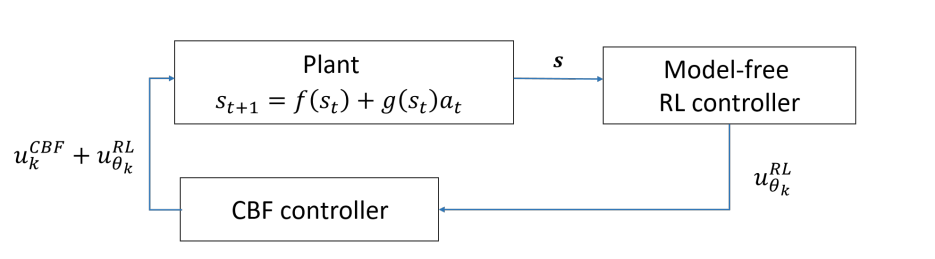

# SafeRL

## Berkenkamp et al. (2017) - Safe Model-Based Reinforcement Learning with Stability Guarantees

- **Motivation**: Standard RL learns by exploration, but in real physical systems such as robots or self-driving cars, unsafe exploration can damage the system or harm the environment. The authors want RL agents to improve over time without ever taking actions that make the system unrecoverable. They frame safety as stability: the system should remain inside a recoverable region and eventually return to a goal state.
- **Key Idea**: Start with a small, known-safe policy. Use a statistical dynamics model, especially a Gaussian process, to estimate uncertain system dynamics. Then use a Lyapunov function to certify which states/actions are safe. The agent only collects data from safe state-action pairs, improves the model, updates the policy, and gradually expands the certified safe region.

Consider a deterministic. discrete-time dynamic system:
$$x_{t+1} = f(x_t, u_t) = h(x_t, u_t) + g(x_t, u_t) \quad \quad (1)$$

with 
- states $x \in \mathcal{X} \subset \mathbb{R}^q$,
- actions $u \in \mathcal{U} \subset \mathbb{R}^p$ and 
- a discrete time index $t \in N$. 
- $h(x_t, u_t)$ is a known prior model of the system dynamics that can be obtained from first principles, and 
- $g(x_t, u_t)$ is a priori unknown model errors.
- We only can obtain noisy measurements by sampling/driving the system
- Without loss of generality, we assume the goal state is $x=0$ 
- cost function $r(x,u) \geq 0 $ , $r(0,0) = 0$ 

Objective: find a control policy $\pi: \mathcal{X} \to \mathcal{U}$ that:
- drive the system from the current state to the goal state by a safely learning process.
- Adapt the policy for performance
- without encountering system failures. Specifically, this means that adapting the policy is not allowed to decrease the ROA and explore actions that not allowed to drive the system outside the ROA.

The theory presented in this paper relies on the following assumptions:
- **Assumption 1** (continuity). The dynamics $h(\cdot)$ and $g(\cdot)$ in (1) are $L_h$- and $L_g$-Lipschitz continuous with respect to the $1$-norm. The considered control policies $\pi$ lie in a set $\Pi_L$ of functions that are $L_\pi$-Lipschitz continuous with respect to the $1$-norm.
    - Assumption 1 ensures regularity of the system and policy. Since the dynamics and policy are Lipschitz continuous, small changes in state or action cannot cause arbitrarily large changes in the next state. This allows the algorithm to generalize safety information from sampled or discretized points to nearby continuous states, and ensures that the closed-loop system remains well behaved under the learned policy.
    - Good intuition: Trong thế giới thực, không gian trạng thái (state space) là liên tục. Bộ nhớ máy tính thì hữu hạn, nên chúng ta không thể kiểm tra tính an toàn trên từng điểm nhỏ li ti của không gian được. Chúng ta buộc phải rời rạc hóa (discretization) không gian thành một lưới các điểm cách nhau một khoảng τ.  Nhưng nếu robot nằm ở giữa hai điểm trên lưới thì sao? Làm sao để đảm bảo an toàn? Đó là lúc giả định Lipschitz Continuity (Tính liên tục Lipschitz) phát huy sức mạnh.

- **Assumption 2** (well-calibrated model). Let $\mu_n(\cdot)$ and $\Sigma_n(\cdot)$ denote the posterior mean and covariance matrix functions of the statistical model of the dynamics (1) conditioned on $n$ noisy measurements. With $\sigma_n(\cdot)=\operatorname{trace}(\Sigma_n^{1/2}(\cdot))$, there exists a $\beta_n > 0$ such that with probability at least $(1-\delta)$ it holds for all $n \geq 0$, $\mathbf{x}\in\mathcal{X}$, and $\mathbf{u}\in\mathcal{U}$ that $\|f(\mathbf{x},\mathbf{u})-\mu_n(\mathbf{x},\mathbf{u})\|_1 \leq \beta_n\sigma_n(\mathbf{x},\mathbf{u})$.
    - (Copy without deep understanding - Will be check again in the future) Assumption 2 ensures that the statistical dynamics model is reliable enough for safety certification. With high probability, the true dynamics lie inside the model’s confidence interval around the posterior mean. Therefore, the algorithm can use conservative upper bounds on the Lyapunov decrease condition to decide whether a state-action pair is safe, without over-trusting uncertain model predictions.

**Theorem 1** . Let $v$ be a Lyapunov function, $f$ Lipschitz continuous dynamics, and $\pi$ a policy. If $v(f(\mathbf{x},\pi(\mathbf{x}))) < v(\mathbf{x})$ for all $\mathbf{x}$ within the level set $\mathcal{V}(c)=\{\mathbf{x}\in\mathcal{X}\setminus\{0\}\mid v(\mathbf{x})\leq c\}$, $c>0$, then $\mathcal{V}(c)$ is a region of attraction, so that $\mathbf{x}_0\in\mathcal{V}(c)$ implies $\mathbf{x}_t\in\mathcal{V}(c)$ for all $t>0$ and $\lim_{t\to\infty}\mathbf{x}_t=\mathbf{0}$.

*Note: In discrete model $v(f(\mathbf{x},\pi(\mathbf{x}))) < v(\mathbf{x})$ means $v(x_{t+1}) < v(x_t)$ as same as $\dot{v}(x) < 0$ in continuous model.*

In general, it is not easy to find suitable Lyapunov functions. However, for physical models, like the prior model $h$ in (1), the energy of the system (e.g., kinetic and potential for mechanical systems) is a good candidate Lyapunov function. Moreover, it has recently been shown that it is possible to compute suitable Lyapunov functions [31, 32]. In our experiments, we exploit the fact that value functions in RL are Lyapunov functions if the costs are strictly positive away from the origin. This follows directly from the definition of the value function, where $v(\mathbf{x}) = r(\mathbf{x}, \pi(\mathbf{x})) + v(f(\mathbf{x}, \pi(\mathbf{x}))) \leq v(f(\mathbf{x}, \pi(\mathbf{x})))$. Thus, we can obtain Lyapunov candidates as a by-product of approximate dynamic programming.

ok có 1 policy ổn định tìm dược từ first principle quanh 1 local region . Cần compute the ROA under this policy.

Nhưng vấn đề là không biết dynamic chính xác do không có model error.
Ta giải quyết điều này bằng cách xây 1 high-probability confidence intervals on v(f(x,u)): $\mathcal{Q}_n(\mathbf{x}, \mathbf{u}) := \left[v(\mu_{n-1}(\mathbf{x}, \mathbf{u})) \pm L_v \beta_n \sigma_{n-1}(\mathbf{x}, \mathbf{u})\right].$ that make sure $v(f(\mathbf{x}, \mathbf{u})) \in \mathcal{Q}_n(\mathbf{x}, \mathbf{u})$ with probability at least $(1-\delta)$.

!!!! Điều quan trọng là ta cần ước lượng GP là chuẩn.
Giả sử ước lượng GP là chuẩn thì ta tìm ROA thỏa mãn upper $\mathcal{Q}_n(\mathbf{x}, \mathbf{u}) < v(\mathbf{x})$

Khi bắt đầu quá trình huấn luyện, GP chưa có dữ liệu thực tế nên độ bất định cao ngất ngưởng Hệ quả là cái trần $v_n​(x,u)$ bị đẩy lên cực kỳ cao, dẫn đến việc chỉ có một dải tọa độ x rất, rất nhỏ bé quanh điểm cân bằng mới thỏa mãn được bất đẳng thức trên.

### part 2 
Notation:
- $\mathbf{x}$: state.

- $\mathbf{a}$: action, thay vì dùng $\mathbf{u}$, để tránh nhầm.

- $\mathbf{z} = (\mathbf{x}, \mathbf{a})$: một state-action pair.

- $\pi_n$: policy ở vòng học thứ $n$.

- $v(\mathbf{x})$: Lyapunov function.

- $\mathcal{V}(c)$: level set của Lyapunov function, tức

$$
\mathcal{V}(c)=\{\mathbf{x}\in\mathcal{X}:v(\mathbf{x})\le c\}.
$$

- $\mathcal{X}_{\tau}$: grid rời rạc của state space.

- $\mathcal{U}_{\tau}$: grid rời rạc của action space, nếu cần chọn action rời rạc để explore.

- $\tau$: độ phân giải của grid.

- $L_{\Delta v}$: Lipschitz constant dùng để bù sai số khi kiểm tra Lyapunov decrease trên grid thay vì toàn state space.

- $\bar{v}_n(\mathbf{x},\mathbf{a})$: upper confidence bound của giá trị $v(f(\mathbf{x},\mathbf{a}))$. Paper ký hiệu là $u_n(\mathbf{x},\mathbf{u})$.

- $\underline{v}_n(\mathbf{x},\mathbf{a})$: lower confidence bound của $v(f(\mathbf{x},\mathbf{a}))$. Paper ký hiệu là $l_n(\mathbf{x},\mathbf{u})$.

- $c_n$: mức Lyapunov lớn nhất được certify ở vòng $n$.

- $\mathcal{S}_n$: tập state-action có thể đo/thử nghiệm an toàn ở vòng $n$.

- $\mathcal{D}_n$: tập state-action làm Lyapunov giảm đủ mạnh, dùng để certify policy.

### Algorithm SAFE LYAPUNOV LEARNING

**Input:**
- initial safe policy $\pi_0$
- GP dynamics model with posterior mean $\mu$ and uncertainty $\sigma$
- Lyapunov function $v$
- state grid $\mathcal{X}_{\tau}$
- action grid $\mathcal{U}_{\tau}$
- initial safe set

**For** $n = 1, 2, \ldots$:

1. **Policy update:**
   
   Find $\pi_n$ by minimizing model-based cost plus Lyapunov safety penalty.

    

    
<b>Click for detail</b>

    

    $$\pi_n=\arg\min_{\pi_\theta\in\Pi_L}\int_{\mathbf{x}\in\mathcal{X}}\left[r(\mathbf{x},\pi_\theta(\mathbf{x}))+\gamma J_{\pi_\theta}\!\left(\mu_{n-1}(\mathbf{x},\pi_\theta(\mathbf{x}))\right)+\lambda\left(\bar{v}_n(\mathbf{x},\pi_\theta(\mathbf{x}))-v(\mathbf{x})+L_{\Delta v}\tau\right)\right]\,d\mathbf{x}.$$

    Tại mỗi step n, lấy 1 batch các state x từ grid Xt, cho qua policy thu được action, từ đó update GP model
    
    Từ dữ liệu đó ta update GP model

    Ở đây ta chỉ update policy model, còn cost-to-go thì sao??

    

    

2. **Certification:**
   $$\mathcal{D}_n=\{(\mathbf{x},\mathbf{a})\in\mathcal{X}_{\tau}\times\mathcal{U}:\bar{v}_n(\mathbf{x},\mathbf{a})-v(\mathbf{x})<-L_{\Delta v}\tau\}$$

   Find the largest $c_n$ such that for every grid state $\mathbf{x}$ in $\mathcal{V}(c_n)$, the action $\pi_n(\mathbf{x})$ satisfies:
   
   $$ \bar{v}_n(x,\pi_n(x)) < v(x) - L_{\Delta v}\tau  \quad \forall x \in \mathcal{V}(c_n) \cap \mathcal{X}_{\tau} $$

    

    
<b>Click for detail</b>

    

    
    Tìm c_n bằng cách lặp qua mọi giá trị x trong grid và kiểm tra điều kiện trên, c_n = max v(x) thỏa mãn điều kiện trên
    
    Với không gian lớn và nhiều chiều việc này là bất khả thi
    

    

3. **Safe exploration set:**
   
   Build $\mathcal{S}_n=\{(\mathbf{x},\mathbf{a}):\mathbf{x}\in\mathcal{V}(c_n),\ \mathbf{a}\in\mathcal{U}_{\tau},\ \bar{v}_n(\mathbf{x},\mathbf{a})\le c_n\}.$ 
    It means $\mathcal{S}_n$ contains all point $(x,a)$ that if at state $s$, action $a$ is taken, the next state will be in the certified ROA $\mathcal{V}(c_n)$ with high probability.
    

    
<b>Click for detail</b>

    

    
    Lấy từng state s nằm trong certified ROA tìm được ở step 2, xét mọi action trong action grid, cái nào thỏa mãn điều kiện của Sn thì add nó vào Sn

    

    

4. **Active exploration:**
   
   Choose $(\mathbf{x}_n, \mathbf{a}_n)$ in $\mathcal{S}_n$ where model uncertainty is largest.
   Choose $(x_n,a_n) = \arg\max_{(x,a)\in\mathcal{S}_n} [\bar{v}_n(\mathbf{x},\mathbf{a}) - \underline{v}_n(\mathbf{x},\mathbf{a})]$
    

    
<b>Click for detail</b>

    

    Thứ đang cản trở việc mở rộng ROA là uncertainty của GP, do vậy, ta sẽ đi vào điểm có uncertainty cao nhất để khám phá giúp update model và giảm uncertainty cùng vùng này. GP model được update tại step này.

    Triển khai thì vẫn phải lặp qua mọi candiate trong $S_n$ rồi tìm arg_max vẫn siêu tốn kém
    

    

5. **Execute safely:**
   
   Drive system to $\mathbf{x}_n$ using $\pi_n$ as backup.
   
   Apply $\mathbf{a}_n$.
   
   Observe next state.
    

    
<b>Click for detail</b>

    

    Sử dụng thuật toán control để đưa hệ tới target state $x_n$, quá trình di chuyển không cần tuân theo đùng policy hiện tại nhưng phải đảm bảo an toàn tại từng step
    - Nếu không tìm được đường tới $x_n$ ta thử 1 điểm X_n khác mà variance cao thứ 2, cứ thế ,...
    - Nếu đang đi mà bị chặn lại do không an toàn thì dừng luôn ở điểm đó
    - Nếu vẫn không được, bỏ qua, thực hiện action theo policy hiện tại là được

    

    

6. **Model update:**
   
   Add the new measurement to dataset.
   
   Update GP posterior.
    

    
<b>Click for detail</b>

    

    

    

## Richard Cheng et al. (2019) - End-to-End Safe Reinforcement Learning through Barrier Functions for Safety-Critical Continuous Control Tasks
### Preliminaries
Consider an infinite-horizon discounted Markov decision process (MDP) with control-affine, deterministic dynamics (a good assumption when dealing with robotic systems), defined by the tuple $(S, A, f, g, d, r, \rho_0, \gamma)$, where $S$ is a set of states, $A$ is a set of actions, $f:S\to S$ is the nominal unactuated dynamics, $g:S\to\mathbb{R}^{n,m}$ is the nominal actuated dynamics, and $d:S\to S$ is the unknown system dynamics. The time evolution of the system is given by

$$
s_{t+1}=f(s_t)+g(s_t)a_t+d(s_t),
$$

where $s_t\in S$, $a_t\in A$, $f$ and $g$ compose a known nominal model of the dynamics, and $d$ represents the unknown model. In practice, the nominal model may be quite bad (e.g. a robot model that ignores friction and compliance), and we must learn a much better dynamic model through data.

Furthermore $r:S\times A\to\mathbb{R}$ is the reward function, $\rho_0:S\to\mathbb{R}$ is the distribution of the initial state $s_0$, and $\gamma\in(0,1)$ is the discount factor.

### Gaussian Process
Gaussian process model is used to estimate the unknowm system dynamics $d(s)$ from data. A Gaussian pro-
cess is a nonparametric regression method for estimating
functions and their uncertain distribution from data.

### Control Barrier Functions

The model-free RL controller, $u_{\theta_k}^{RL}(s)$, proposes a control action that attempts to optimize long-term reward, but may be unsafe. Before deploying the RL controller, a CBF controller $u_k^{CBF}(s,u_{\theta_k}^{RL})$ filters the proposed control action and provides the minimum control intervention needed to ensure that the overall controller, $u_k(s)$, keeps the system state within the safe set. Essentially, the CBF controller, $u_k^{CBF}(s,u_{\theta_k}^{RL})$, “projects” the RL controller $u_{\theta_k}^{RL}(s)$ into the set of safe policies. In the case of an autonomous car, this action may enforce a safe distance between nearby cars, regardless of the action proposed by the RL controller.

The CBF controller $u_k^{CBF}(s,u_{\theta_k}^{RL})$, which depends on the RL control, is defined by the following QP that can be efficiently solved at each time step:

$$
(a_t,\epsilon)
=
\arg\min_{a_t,\epsilon}
\|a_t\|_2 + K_{\epsilon}\epsilon
$$

$$
\text{s.t.}\quad
p^T f(s_t)
+
p^T g(s_t)\Big(u_{\theta_k}^{RL}(s_t)+a_t\Big)
+
p^T \mu_d(s_t)
-
k_{\delta}|p|^T\sigma_d(s_t)
+
q
\ge
(1-\eta)h(s_t)-\epsilon
$$

$$
a_{low}^{\,i}
\le
a_t^{\,i}
+
u_{\theta_k}^{RL(i)}(s_t)
\le
a_{high}^{\,i},
\qquad
\text{for } i=1,\ldots,M.
$$

The last constraint in (14) incorporates possible actuator limits of the system.

Intuitively, the RL controller provides a “feedforward
control”, and the CBF controller compensates with the mini-
mum control necessary to render the safe set forward invari-
ant.

## Chow et al. (2019) - Lyapunov-Based Safe Policy Optimization for Continuous Control
### Preliminaries

We consider the RL problem in which the agent’s interaction with the environment is modeled as a Markov decision process (MDP). A MDP is a tuple $(\mathcal{X}, \mathcal{A}, \gamma, c, P, x_0)$, where $\mathcal{X}$ and $\mathcal{A}$ are the state and action spaces; $\gamma \in [0,1)$ is a discounting factor; $c(x,a)\in[0,C_{\max}]$ is the immediate cost function; $P(\cdot|x,a)$ is the transition probability distribution; and $x_0\in\mathcal{X}$ is the initial state. Although we consider deterministic initial state and cost function, our results can be easily generalized to random initial states and costs. We model the RL problems in which there are constraints on the cumulative cost using CMDPs. The CMDP model extends MDP by introducing additional costs and the associated constraints, and is defined by $(\mathcal{X}, \mathcal{A}, \gamma, c, P, x_0, d, d_0)$, where the first six components are the same as in the unconstrained MDP; $d(x)\in[0,D_{\max}]$ is the (state-dependent) immediate constraint cost; and $d_0\in\mathbb{R}_{\geq 0}$ is an upper-bound on the expected cumulative constraint cost.

To formalize the optimization problem associated with CMDPs, let $\Delta$ be the set of Markovian stationary policies, i.e.,

$$
\Delta=\left\{\pi:\mathcal{X}\times\mathcal{A}\to[0,1],\ \sum_a\pi(a|x)=1\right\}.
$$

At each state $x\in\mathcal{X}$, we define the generic Bellman operator w.r.t. a policy $\pi\in\Delta$ and a cost function $h$ as

$$
T_{\pi,h}[V](x)
=
\sum_a \pi(a|x)
\left[
h(x,a)
+
\gamma
\sum_{x'\in\mathcal{X}}
P(x'|x,a)V(x')
\right].
$$

Given a policy $\pi\in\Delta$, we define the expected cumulative cost and the safety constraint function (expected cumulative constraint cost) as

$$
\mathcal{C}_{\pi}(x_0)
:=
\mathbb{E}
\left[
\sum_{t=0}^{\infty}
\gamma^t c(x_t,a_t)
\ \middle|\ 
\pi,x_0
\right]
$$

and

$$
\mathcal{D}_{\pi}(x_0)
:=
\mathbb{E}
\left[
\sum_{t=0}^{\infty}
\gamma^t d(x_t)
\ \middle|\ 
\pi,x_0
\right].
$$

The safety constraint is then defined as

$$
\mathcal{D}_{\pi}(x_0)\le d_0.
$$

The goal in CMDPs is to solve the constrained optimization problem

$$
\pi^*
\in
\min_{\pi\in\Delta}
\left\{
\mathcal{C}_{\pi}(x_0):
\mathcal{D}_{\pi}(x_0)\le d_0
\right\}.
$$

It has been shown that if the feasibility set is non-empty, then there exists an optimal policy in the class of stationary Markovian policies $\Delta$ (Altman, 1999, Theorem 3.1).

