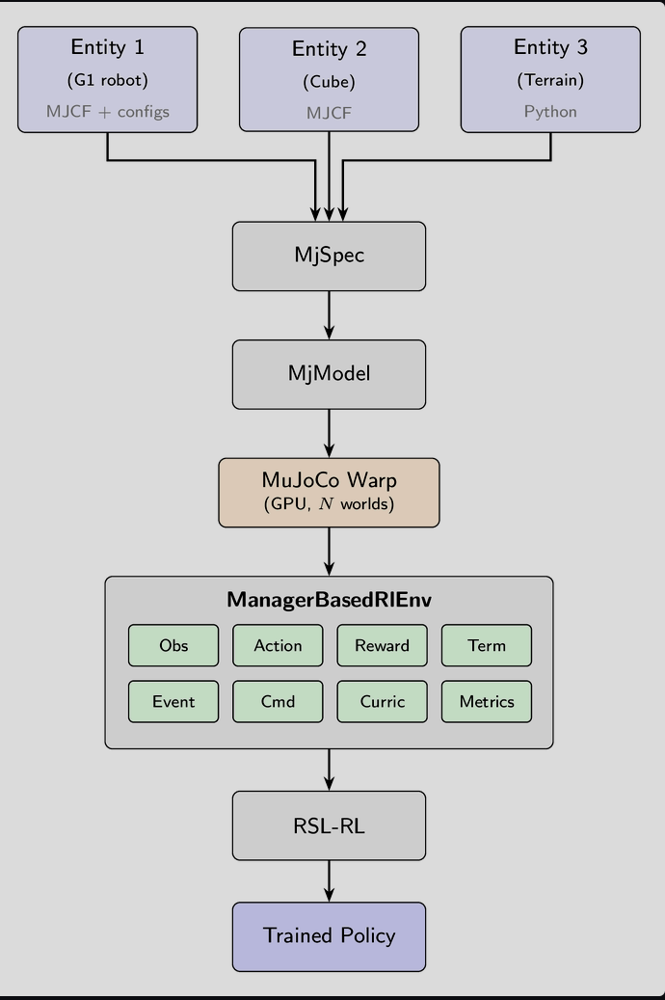

MjSpec can be understand as a wrapper from xml files.\
MjSpec -> compile -> MjModel \
trong đó MjModel là những thứ bất biến của model\
sau khi khởi tạo 1 trạng thái ban đầu cho MjData, sau mỗi step MjData sẽ update trạng thái hiện tại của model. MjData chứa những gì thay đổi theo thời gian.\
Phần từ Entity i -> MujocoWarp là simulation layer

Components. The simulation layer provides four core components, each with its own documentation page:

    Entity: a robot, a manipulated object, or a static object such as terrain, defined by an MJCF description plus optional Python configuration for actuators, collision rules, and initial state.

    Actuators: how entities are controlled. Users can wrap actuators already defined in MJCF or create new ones from Python configuration.

    Sensors: how the world is observed. Includes MuJoCo-native sensors as well as custom sensors like RGB-D cameras and raycasters.

    Scene: scene composition and environment placement.


### Manager layer 

Luồng dữ liệu:

```text
Command / mục tiêu
        │
        ▼
Observations ──► Policy ──► Actions ──► MuJoCo physics
     ▲                                      │
     └──────── trạng thái mới ◄─────────────┘
                    │
          Rewards / Terminations / Metrics
```

Các hệ thống còn lại hoạt động quanh vòng lặp này:

* **Events** thay đổi trạng thái tại startup, reset hoặc giữa episode.
* **Domain Randomization** dùng Events để thay đổi các tham số vật lý.
* **Curriculum** điều chỉnh độ khó dựa trên tiến trình học.
* **Recorders** ghi dữ liệu rollout ra file hoặc hệ thống bên ngoài.

# 2. Environment Configuration

## Vai trò

`ManagerBasedRlEnvCfg` là cấu hình trung tâm mô tả gần như toàn bộ môi trường:

* vật lý mô phỏng;
* scene, robot, terrain và sensor;
* observation và action space;
* reward, termination và command;
* event, randomization, curriculum;
* metric, recorder và viewer.

Ví dụ:
```python
env_cfg = ManagerBasedRlEnvCfg(
    decimation=4,
    episode_length_s=20.0,
    sim=simulation_cfg,
    scene=scene_cfg,

    observations=observation_cfg,
    actions=action_cfg,
    commands=command_cfg,
    rewards=reward_cfg,
    terminations=termination_cfg,
    events=event_cfg,
    curriculum=curriculum_cfg,
    metrics=metric_cfg,
    recorders=recorder_cfg,
)
```

## 3 timestep types

- `sim.mujoco.timestep`: Khoảng thời gian của **một bước vật lý**.

- `decimation`: Số bước physics được chạy cho mỗi lần policy đưa ra action mới.

- `episode_length_s`: Thời lượng tối đa của episode theo giây.

## `scale_rewards_by_dt`

Mặc định reward được nhân với `step_dt`. Mục đích là để tổng reward của một episode không thay đổi quá nhiều chỉ vì bạn đổi control frequency.

Ví dụ reward function luôn trả `1`:

* ở 50 Hz, mỗi bước đóng góp khoảng `0.02`;
* ở 200 Hz, mỗi bước đóng góp khoảng `0.005`.

Sau 20 giây, cả hai đều tích lũy gần 20.


## Finite horizon và time limit

Cần phân biệt:

* **Task thực sự kết thúc**: robot ngã, vật rơi, vi phạm điều kiện an toàn.
* **Episode bị cắt vì giới hạn thời gian**: agent chưa nhất thiết thất bại.

Trong RL, trường hợp thứ hai thường được coi là `truncated`, cho phép value function bootstrap giá trị tương lai. Trường hợp thất bại thật được coi là `terminated`.

`is_finite_horizon` và cờ `time_out` trong termination config để biễu diễn cho 2 cái này.

## Events mặc định

Cấu hình mặc định có event `reset_scene_to_default`, đưa các entity về trạng thái ban đầu khi reset. 
---

# 3. Observations

## Observation là gì?

Observation là những gì policy được phép “nhìn thấy”, chẳng hạn:

* vận tốc thân robot;
* hướng trọng lực trong frame của robot;
* vị trí và vận tốc joint;
* command hiện tại;
* action trước đó;
* dữ liệu IMU, contact hoặc raycast;
* dữ liệu privileged chỉ dùng cho critic. (policy không thấy)

Mỗi observation group chứa nhiều `ObservationTermCfg`. Theo mặc định, output của các term được nối theo chiều cuối thành tensor:

```text
[num_envs, observation_dim]
```

Có thể đặt `concatenate_terms=False` để nhận dictionary các tensor riêng biệt. 

## Observation group

Ví dụ thường gặp:

```python
observations = {
    "actor": ObservationGroupCfg(...),
    "critic": ObservationGroupCfg(...),
}
```

`actor` là dữ liệu policy sử dụng để sinh action.

`critic` là dữ liệu value network sử dụng trong quá trình train. Critic có thể nhận thêm thông tin mà robot thật không có, ví dụ terrain height chính xác hoặc contact state lý tưởng.

## Pipeline xử lý

Mỗi observation term đi qua pipeline theo đúng thứ tự:

```text
compute → noise → clip → scale → delay → history
```

### 1. Compute

Gọi observation function để lấy tensor thô:

```text
[num_envs, D]
```

### 2. Noise

Thêm nhiễu để mô phỏng sensor thật. Noise chỉ hoạt động khi group có:

```python
enable_corruption=True
```

Có cả noise stateless và noise model có trạng thái qua nhiều bước.

### 3. Clip

Giới hạn giá trị trong một khoảng:

```python
clip=(-10.0, 10.0)
```

Việc này giúp ngăn các giá trị bất thường quá lớn đi vào neural network.

### 4. Scale

Nhân output với scalar, tuple hoặc tensor:

```python
scale=0.1
```

Ví dụ joint velocity có độ lớn hàng chục có thể được scale xuống để gần cùng thang với các observation khác.

### 5. Delay

Trả về dữ liệu từ một policy step trước đó để mô phỏng độ trễ sensor.

### 6. History

Ghép nhiều frame quan sát liên tiếp để policy thấy được diễn biến theo thời gian.

Delay được thực hiện **trước history**, nghĩa là history chứa lịch sử của tín hiệu đã bị trễ—gần với sensor thật hơn. ([MujocoLab][3])

## Observation history

Với:

```python
history_length=4
```

manager giữ bốn observation gần nhất.

Mặc định:

```python
flatten_history_dim=True
```

Tensor từ:

```text
[num_envs, 4, D]
```

được flatten thành:

```text
[num_envs, 4 × D]
```

Cách này phù hợp với MLP. Với RNN hoặc Transformer, có thể giữ chiều thời gian bằng `flatten_history_dim=False`.

Khi reset, history buffer được xóa và observation đầu tiên được điền vào toàn bộ slot, vì vậy policy không nhận các giá trị rỗng hoặc zero giả tạo ở đầu episode. ([MujocoLab][3])

## Observation delay

Ví dụ control ở 50 Hz:

```text
1 policy step = 20 ms
```

Sensor latency 40 ms tương ứng:

```text
lag = 40 / 20 = 2 bước
```

Có thể cấu hình một khoảng lag:

```python
delay_min_lag=1
delay_max_lag=3
```

Mỗi environment có thể có độ trễ riêng, giúp policy chịu được sự khác biệt latency giữa các robot hoặc thiết bị. Delay chỉ được lượng tử hóa theo policy step, không phải physics substep. 

## Một số observation có sẵn

* `base_lin_vel`: vận tốc tuyến tính của base trong body frame.
* `base_ang_vel`: vận tốc góc của base.
* `projected_gravity`: vector trọng lực trong body frame, giúp suy ra roll/pitch.
* `joint_pos_rel`: joint position tương đối với default pose.
* `joint_vel_rel`: joint velocity tương đối.
* `last_action`: action gần nhất.
* `generated_commands`: command hiện tại.
* `builtin_sensor`: dữ liệu MuJoCo sensor.
* `height_scan`: dữ liệu từ raycast sensor. 

## Asymmetric actor–critic

Đây là mẫu thiết kế rất quan trọng cho sim-to-real:

```text
Actor:
  dữ liệu robot thật có thể đo được
  + noise
  + delay

Critic:
  actor observations
  + privileged simulation state
  thường không noise
```

Khi deploy, critic bị bỏ đi; actor vẫn hoạt động vì chưa từng phụ thuộc vào thông tin privileged.

---

# 4. Actions

## Vai trò

Action Manager nhận một tensor từ policy, chia nó thành các đoạn và chuyển từng đoạn đến actuator tương ứng.

Ví dụ policy xuất 12 số cho 12 joint:

```text
action shape = [num_envs, 12]
```

Một action term position-control có thể biến chúng thành joint position target. 

## Công thức xử lý chung

Ở mức đơn giản:

```text
processed_action = clip(raw_action × scale + offset)
```

Trong đó:

* `scale`: đổi action chuẩn hóa thành đơn vị vật lý.
* `offset`: thêm tư thế hoặc vận tốc tham chiếu.
* `clip`: giới hạn target trước khi gửi tới actuator.
* `actuator_names`: regex chọn actuator cần điều khiển.
* `entity_name`: entity nhận action.

Ví dụ:

```python
scale=0.5
use_default_offset=True
```

thì action `0` tương ứng với default joint pose, action `1` tương ứng khoảng default pose cộng `0.5` rad. 

## Các loại action chính

### `JointPositionAction`

Policy điều khiển joint position target:

```text
target = default_position + action × scale
```

Phù hợp khi robot dùng position actuator hoặc PD controller.

### `RelativeJointPositionAction`

Target được tính từ trạng thái hiện tại:

```text
target = current_position + action × scale
```

Action bằng zero có nghĩa là giữ nguyên tư thế hiện tại, không phải quay về default pose.

### `JointVelocityAction`

Điều khiển velocity target.

### `JointEffortAction`

Điều khiển torque/effort trực tiếp. Đây là mức điều khiển thấp hơn và thường khó train hơn.

### Tendon actions

Có điều khiển tendon length, velocity và effort.

### `SiteEffortAction`

Áp force và torque tại một site. Phù hợp với drone hoặc quadrotor, nơi lực đẩy được đặt tại vị trí rotor.

### `DifferentialIKAction`

Nhận target Cartesian của end-effector rồi dùng damped least-squares inverse kinematics để chuyển thành joint displacement/position target.

Tùy cấu hình, action IK có thể là:

```text
3D: vị trí
6D: delta vị trí + delta orientation
7D: vị trí tuyệt đối + quaternion
```

IK được cập nhật ở mỗi decimation substep, giúp end-effector bám target liên tục giữa các lần policy chạy.
## Nhiều action term

Một robot di động có thể có:

```python
actions = {
    "arm": JointPositionActionCfg(...),
    "wheels": JointVelocityActionCfg(...),
}
```

Policy output được nối theo thứ tự đăng ký:

```text
[arm actions | wheel actions]
```

Action Manager tự chia tensor tại đúng ranh giới rồi gửi từng phần đến đúng actuator. Tổng action dimension bằng tổng dimension của tất cả action term. 

## Action history

Manager giữ:

```python
action
prev_action
prev_prev_action
```

Các buffer này được dùng để tính:

```text
action_rate = action_t - action_(t-1)
action_acc  = action_t - 2 action_(t-1) + action_(t-2)
```

Chúng được reset về zero giữa các episode để không rò rỉ thông tin từ episode trước.

---

# 5. Rewards

## Cấu trúc

Mỗi reward term trả về một scalar cho từng environment:

```text
[num_envs]
```

Reward tổng được tính gần giống:

```text
reward = Σ weight_i × term_i
```

Nếu `scale_rewards_by_dt=True`:

```text
reward = step_dt × Σ weight_i × term_i
```

Weight dương tạo thưởng; weight âm tạo penalty. 

Ví dụ:

```python
rewards = {
    "track_velocity": RewardTermCfg(
        func=track_velocity,
        weight=2.0,
    ),
    "torque_penalty": RewardTermCfg(
        func=joint_torques_l2,
        weight=-1e-4,
    ),
    "action_smoothness": RewardTermCfg(
        func=action_rate_l2,
        weight=-0.1,
    ),
}
```

Reward tổng ở đây khuyến khích robot bám vận tốc, nhưng hạn chế torque và action giật.

## Các reward có sẵn đáng chú ý

* `is_alive`: thưởng sống sót.
* `is_terminated`: phát hiện kết thúc do failure, không tính timeout.
* `joint_torques_l2`: tổng bình phương actuator force.
* `joint_vel_l2`: phạt joint velocity lớn.
* `joint_acc_l2`: phạt joint acceleration lớn.
* `action_rate_l2`: phạt action thay đổi nhanh.
* `action_acc_l2`: phạt rung tần số cao hơn.
* `joint_pos_limits`: phạt vượt soft joint limits.
* `posture`: đo mức gần default pose bằng exponential kernel.
* `electrical_power_cost`: phạt công suất cơ học tiêu thụ.
* `flat_orientation_l2`: phạt robot nghiêng khỏi phương thẳng đứng. 
## Cách hiểu reward shaping

Reward nên được xem như một bài toán nhiều mục tiêu:

```text
Làm đúng nhiệm vụ
+ giữ ổn định
+ dùng ít năng lượng
+ chuyển động mượt
+ không phá giới hạn phần cứng
```

Nếu penalty quá lớn ngay từ đầu, agent có thể học cách “không làm gì” để tránh bị phạt. Đây là một lý do Curriculum có thể tăng penalty dần theo quá trình train.

Reward term cũng được log riêng dưới dạng:

```text
Episode_Reward/<term_name>
```

nên có thể kiểm tra term nào đang chi phối việc học. ([MujocoLab][5])

---

# 6. Terminations

Termination Manager quyết định khi nào episode kết thúc. Mỗi term trả về boolean:

```text
[num_envs]
```

Hai loại kết thúc phải được phân biệt rõ.

## Terminal failure — `terminated`

Task thực sự thất bại:

* robot bị ngã;
* base thấp hơn ngưỡng;
* vật rơi khỏi bàn;
* simulation xuất hiện NaN;
* vi phạm giới hạn an toàn.

Trong trường hợp này, không nên giả định còn future return sau trạng thái cuối.

## Time-limit truncation — `truncated`

Episode dừng vì hết thời gian, nhưng trạng thái chưa chắc là thất bại. Thuật toán RL thường bootstrap value qua điểm này.

Một term được đánh dấu:

```python
time_out=True
```

sẽ được coi là truncation thay vì failure. ([MujocoLab][6])

## Termination có sẵn

* `time_out`: đạt `env.max_episode_length`.
* `bad_orientation`: góc giữa up-axis của robot và world-up vượt giới hạn.
* `root_height_below_minimum`: base thấp hơn ngưỡng.
* `nan_detection`: physics state có NaN hoặc Inf. ([MujocoLab][6])

Một lỗi phổ biến là coi timeout giống robot ngã. Điều này làm target của value function bị sai vì agent bị phạt như thể thất bại dù chỉ đơn giản hết thời gian.

---

# 7. Commands

## Command khác action thế nào?

* **Command** nói agent phải đạt cái gì.
* **Action** nói robot phải điều khiển actuator thế nào.

Ví dụ:

```text
Command: chạy về trước với 1 m/s
Action: 12 joint position targets
```

Command thường được đưa vào observation để policy biết mục tiêu hiện tại. ([MujocoLab][7])

## Resampling

Command term là class có trạng thái. Trường:

```python
resampling_time_range=(3.0, 8.0)
```

có nghĩa là command được giữ trong một khoảng ngẫu nhiên từ 3 đến 8 giây rồi lấy mẫu lại. Command cũng luôn được lấy mẫu lại khi episode reset.

Việc giữ command trong một thời gian giúp agent có đủ thời gian phản ứng, thay vì mục tiêu thay đổi mỗi step. ([MujocoLab][7])

## Các command term tiêu biểu

### `UniformVelocityCommand`

Sinh:

```text
[v_x, v_y, ω_z]
```

Có thể hỗ trợ:

* một tỷ lệ environment nhận command đứng yên;
* heading mode, trong đó yaw rate được điều khiển để bám một heading target.

### `LiftingCommand`

Sinh target position 3D cho object trong bài toán manipulation, đồng thời theo dõi position error và success rate.

### `MotionCommand`

Đọc reference motion từ `.npz`, gồm joint position, velocity và body pose. Có thể chọn frame bắt đầu:

* từ frame đầu;
* lấy ngẫu nhiên;
* adaptive, tập trung hơn vào vùng motion policy đang làm kém.

([MujocoLab][7])

## Custom command

Một custom command term cần triển khai logic để:

```text
lấy mẫu command mới
cập nhật command mỗi step
cập nhật metric
trả về tensor command hiện tại
```

Base class tự quản lý timer và reset. ([MujocoLab][7])

---

# 8. Events

Events là các hook chạy ở những thời điểm nhất định trong vòng đời môi trường.

## Bốn mode

### `startup`

Chạy một lần khi khởi tạo environment.

Phù hợp với các tham số muốn khác nhau giữa các environment nhưng giữ cố định suốt lần train, ví dụ:

* mass;
* armature;
* offset calibration;
* camera placement.

### `reset`

Chạy khi một environment bắt đầu episode mới.

Phù hợp với:

* reset robot về initial state;
* random initial pose;
* random joint state;
* random friction theo từng episode.

Có thể dùng `min_step_count_between_reset` để tránh event bị gọi quá dày khi episode kết thúc liên tục.

### `interval`

Chạy định kỳ giữa episode. Mỗi environment mặc định có timer riêng.

Phù hợp với:

* đẩy robot ngẫu nhiên;
* thay đổi tham số chậm theo thời gian;
* perturbation giữa episode.

`is_global_time=True` làm tất cả environment dùng chung timer.

### `step`

Chạy mỗi environment step.

Chỉ nên dùng cho logic nhẹ hoặc logic tự quản lý thời gian hoạt động, ví dụ một impulse kéo dài 0.15 giây rồi cooldown vài giây. ([MujocoLab][8])

## Event có sẵn

* `reset_scene_to_default`
* `reset_root_state_uniform`
* `reset_root_state_from_flat_patches`
* `reset_joints_by_offset`
* `push_by_setting_velocity`
* `apply_external_force_torque`
* `apply_body_impulse`
* `randomize_terrain`

`SceneEntityCfg` trong params được resolve sang model indices ngay khi manager được tạo, nên regex không phải được tìm lại ở mọi step. ([MujocoLab][8])

## Event và Domain Randomization

Domain Randomization không phải một lifecycle manager riêng biệt. Nó thường là **các event term gọi hàm trong module `dr`**:

```python
EventTermCfg(
    mode="reset",
    func=dr.geom_friction,
    params={...},
)
```

Nói ngắn gọn:

```text
Event quyết định khi nào thay đổi.
DR quyết định thay đổi tham số gì và thay đổi thế nào.
```

---

# 9. Domain Randomization

## Mục tiêu

Domain Randomization tạo nhiều phiên bản hơi khác nhau của mô hình vật lý trong quá trình train. Policy buộc phải học hành vi bền vững thay vì khai thác một bộ tham số simulation duy nhất.

Ví dụ các environment song song có thể có:

* ma sát chân khác nhau;
* mass và center of mass khác nhau;
* motor gain khác nhau;
* encoder bias khác nhau;
* camera, ánh sáng và màu vật liệu khác nhau.

Điều này đặc biệt quan trọng cho sim-to-real. ([MujocoLab][9])

## Ba khái niệm cơ bản

### `ranges`

Khoảng lấy mẫu:

```python
ranges=(0.3, 1.2)
```

### `distribution`

Cách lấy mẫu:

* `"uniform"`: đều trong khoảng.
* `"log_uniform"`: đều trong log-space; phù hợp với tham số có nhiều bậc độ lớn.
* `"gaussian"`: `ranges` được hiểu là `(mean, std)`.
* Có thể tự định nghĩa distribution mới. ([MujocoLab][9])

### `operation`

Cách áp mẫu lên giá trị model:

```text
"abs"   : đặt bằng sample
"scale" : default × sample
"add"   : default + sample
```

Điểm quan trọng: `scale` và `add` mặc định luôn áp lên **giá trị model ban đầu**, không áp lên kết quả lần randomization trước.

Ví dụ gọi scale `2×` ba lần vẫn cho:

```text
2 × default
```

chứ không thành:

```text
8 × default
```

Điều này ngăn randomization tích lũy ngoài kiểm soát. Muốn tham số thật sự drift theo thời gian, phải tạo custom operation đọc current value. ([MujocoLab][9])

## Chọn axis

Nhiều model field có nhiều thành phần.

Ví dụ:

```text
geom_friction =
[tangential, torsional, rolling]
```

Có thể randomize một phần:

```python
ranges={0: (0.3, 1.2)}
```

hoặc nhiều axis:

```python
axes=[0, 1]
ranges=(-0.1, 0.1)
```

Cũng có thể dùng regex để đặt range riêng:

```python
ranges={
    ".*knee.*": (0.5, 1.5),
    ".*hip.*": (0.8, 1.2),
}
```

([MujocoLab][9])

## Các nhóm tham số có thể randomize

### Geometry

* friction;
* position và orientation;
* size của primitive geometry;
* màu sắc;
* material ID.

### Rigid body

* mass;
* center of mass;
* body position/orientation.

### Joint

* damping;
* armature;
* friction loss;
* stiffness;
* joint limits;
* default joint position.

### Site, tendon và contact pair

* site pose;
* tendon damping/stiffness/friction/armature;
* pair-specific friction.

### Camera, light và material

* camera pose, FOV và intrinsic;
* light position/direction;
* material color, emission, specular, shininess và texture repeat.

### Entity-level randomization

* `pd_gains`: randomize `kp` và `kd`.
* `effort_limits`: randomize actuator force limits.
* `encoder_bias`: thêm bias cố định vào joint position measurement.
* `pseudo_inertia`: randomize mass, COM và inertia theo cách nhất quán vật lý. ([MujocoLab][9])

## Pseudo-inertia

Không nên tùy tiện randomize mass và inertia độc lập. Một bộ inertia không hợp lệ có thể chứa:

* mass âm;
* principal moment không hợp lệ;
* vi phạm triangle inequality;
* inertia tensor không positive-definite.

`dr.pseudo_inertia` biểu diễn mass, center of mass và inertia trong một ma trận positive-definite, perturb ma trận đó rồi chuyển trở lại các field MuJoCo. Vì vậy kết quả vẫn có ý nghĩa vật lý ngay cả khi perturbation tương đối lớn. ([MujocoLab][9])

Một trường hợp sử dụng phổ biến:

```text
alpha_range:
  thay đổi density
  → mass và inertia cùng scale

t_range:
  dịch center of mass
```

## Những lỗi DR quan trọng

### Chỉ randomize `body_mass`

`dr.body_mass` không tự scale inertia. Với manufacturing hoặc density uncertainty, nên dùng `pseudo_inertia` để mass và inertia thay đổi cùng nhau.

### Dùng degree cho quaternion randomization

Các range roll/pitch/yaw của `*_quat` dùng **radian**, không phải degree.

### Mong orientation tích lũy

Quaternion perturbation được compose với default orientation, không phải orientation hiện tại. Các lần gọi không chồng rotation lên nhau.

### Hiểu sai friction

`dr.geom_friction` mặc định chỉ randomize tangential friction. Torsional và rolling friction chỉ có tác dụng với contact dimension phù hợp.

### Randomize size của mesh

`dr.geom_size` chỉ hỗ trợ primitive geom như sphere, capsule, ellipsoid, cylinder và box; không hỗ trợ mesh, plane hoặc heightfield. ([MujocoLab][9])

## Cơ chế per-world bên trong

MuJoCo Warp chạy hàng nghìn world trong một simulation. Ban đầu một số model arrays có thể dùng chung một hàng dữ liệu để tiết kiệm bộ nhớ. Nếu ghi trực tiếp vào array dùng chung, mọi environment sẽ nhận cùng giá trị randomization.

mjlab tự mở rộng các field cần randomize từ dạng dùng chung sang bộ nhớ riêng cho từng world. Built-in DR function khai báo field cần mở rộng bằng decorator, và Event Manager thu thập thông tin này khi startup. Vì vậy mỗi environment có thể có mass hoặc friction riêng. ([MujocoLab][9])

## Derived quantities

Thay đổi một field có thể làm các đại lượng dẫn xuất trở nên lỗi thời.

Ví dụ thay đổi `body_mass` cũng ảnh hưởng đến subtree mass và các đại lượng solver. mjlab có các mức recomputation tương đương các biến thể `set_const`, tự chọn mức cần thiết và chỉ recompute một lần sau khi nhiều DR term cùng chạy.

Những field như friction hoặc joint damping tác động trực tiếp và thường không cần recompute derived constants. ([MujocoLab][9])

---

# 10. Curriculum

## Khái niệm

Curriculum giống như một giáo viên:

```text
Policy còn yếu → bài tập dễ
Policy tốt dần → tăng độ khó
```

Curriculum term được gọi khi environment reset. Nó xem tín hiệu hiệu suất của episode vừa qua rồi sửa trực tiếp các tham số môi trường. Giá trị trả về được log dưới:

```text
Curriculum/<term_name>
```

([MujocoLab][10])

## Các loại curriculum

### Terrain curriculum

Terrain được sắp thành grid:

```text
columns = các loại terrain
rows    = mức độ khó
```

Robot đi đủ xa thì lên row khó hơn; làm kém thì xuống row dễ hơn. Khi đạt mức cao nhất, environment có thể được phân phối lại để vẫn bao phủ nhiều mức khó. ([MujocoLab][10])

### Command curriculum

Mở rộng command range dần:

```text
Giai đoạn đầu: vx ∈ [-0.3, 0.3]
Sau đó:        vx ∈ [-0.8, 0.8]
Cuối:          vx ∈ [-1.5, 1.5]
```

Agent học giữ thăng bằng và phản ứng ở tốc độ thấp trước khi xử lý command mạnh.

### Reward curriculum

Thay đổi reward weight hoặc params theo training step.

Ví dụ tăng dần penalty:

```text
step 0:      weight = -0.01
step 12000:  weight = -0.1
step 24000:  weight = -1.0
```

Hoặc siết tolerance tracking:

```text
std: 0.5 → 0.3 → 0.1
```

### Termination curriculum

Ban đầu điều kiện termination dễ chịu, sau đó siết dần. Ví dụ giảm energy limit khi robot đã học được hành vi cơ bản. ([MujocoLab][10])

## Curriculum và Domain Randomization khác nhau

```text
Domain Randomization:
  tạo variation để tăng robustness

Curriculum:
  thay đổi độ khó theo tiến trình học
```

Một range friction rộng có thể là DR. Việc mở rộng range friction từng giai đoạn có thể là curriculum điều khiển DR.

---

# 11. Metrics

Metrics đo hành vi nhưng **không ảnh hưởng tối ưu hóa**.

Ví dụ:

* velocity tracking error;
* base height;
* contact force;
* energy consumption;
* success indicator.

Khác reward, metric:

* không có weight;
* không được cộng vào reward;
* không scale theo `step_dt`;
* chỉ dùng để chẩn đoán và so sánh thí nghiệm. ([MujocoLab][11])

## Cách tính

Mỗi step:

1. gọi metric function;
2. cộng giá trị cho từng environment;
3. tăng step counter.

Khi environment reset, manager giảm dữ liệu thành episode value.

Hai chế độ:

### `reduce="mean"`

Lấy trung bình theo số step của chính environment đó. Episode kết thúc sớm không bị pha loãng bởi các episode dài hơn.

### `reduce="last"`

Lấy giá trị ở step cuối. Phù hợp với success flag hoặc trạng thái cuối episode.

Các metric được log dưới:

```text
Episode_Metrics/<term_name>
```

Nếu không đăng ký metric nào, mjlab dùng no-op manager để tránh overhead. 

---

# 12. Recorders

Recorder dùng để ghi dữ liệu rollout:

* observation;
* action;
* reward;
* trạng thái robot;
* trajectory;
* hình ảnh;
* dữ liệu imitation learning.

Recorder không ảnh hưởng reward hoặc policy optimization. Mỗi recorder term là một class có trạng thái; việc ghi CSV, NPZ, database hay video do bạn tự quyết định. 

## Lifecycle hooks

### `record_pre_reset(env_ids)`

Được gọi trước khi các environment đã kết thúc bị reset.

Tại đây:

* terminal action vẫn còn;
* terminal reward vẫn còn;
* action chưa bị zero;
* đây là nơi phù hợp để ghi terminal transition.

### `record_post_reset(env_ids)`

Được gọi sau reset, khi observation đầu tiên của episode mới đã có và action đã bằng zero.

Dùng để:

* ghi initial observation;
* khởi tạo buffer cho episode mới.

### `record_post_step()`

Được gọi cuối mỗi `env.step()`.

Một điểm rất quan trọng: với environment vừa reset trong step này, observation lúc này là initial observation của episode mới và action đã bị zero. Vì vậy không nên dùng hook này để ghi terminal transition; phải ghi ở `record_pre_reset`.

### `close()`

Flush buffer, đóng file hoặc giải phóng tài nguyên khi environment kết thúc. ([MujocoLab][12])

---

# 13. Ví dụ ghép toàn bộ: robot học đi theo vận tốc

Giả sử task yêu cầu quadruped đi theo target velocity.

## Commands

Cứ 3–8 giây sinh một target:

```text
vx, vy, yaw_rate
```

## Observations

Actor nhận:

```text
IMU angular velocity
projected gravity
joint positions
joint velocities
previous action
velocity command
```

Các sensor observation được thêm noise và delay.

Critic nhận thêm:

```text
terrain height
contact state
true base velocity
```

## Actions

Policy xuất joint position offsets:

```text
target_q = default_q + 0.5 × action
```

## Rewards

```text
+ bám target velocity
+ giữ base thẳng
- torque lớn
- joint acceleration lớn
- action thay đổi nhanh
- chạm joint limit
```

## Terminations

```text
robot nghiêng quá 70°
base quá thấp
physics xuất hiện NaN
hết 20 giây
```

Timeout là truncation; ngã là terminal failure.

## Events

```text
startup: randomize mass, PD gains
reset:   reset pose, randomize friction
interval: đẩy robot
step:    quản lý impulse có duration/cooldown
```

## Curriculum

```text
ban đầu: terrain phẳng, command nhỏ
sau đó:  terrain khó hơn, command lớn hơn
cuối:    penalty energy và smoothness mạnh hơn
```

## Metrics

```text
tracking error
episode distance
power consumption
success rate
```

## Recorders

Ghi trajectory của một số environment để:

```text
debug
phân tích failure
tạo dataset
visualize rollout
```

Đây chính là triết lý của Manager Layer: mỗi khối chỉ chịu trách nhiệm cho một phần rõ ràng của bài toán, nhưng tất cả được ghép lại bằng một cấu hình duy nhất.

---

# 14. Các cặp khái niệm dễ nhầm

| Khái niệm            | Chức năng                                |
| -------------------- | ---------------------------------------- |
| Observation          | Agent hiện đang biết gì                  |
| Command              | Agent được yêu cầu đạt mục tiêu gì       |
| Action               | Agent gửi lệnh điều khiển nào            |
| Reward               | Tín hiệu dùng để học                     |
| Metric               | Số liệu chỉ dùng để theo dõi             |
| Termination          | Khi nào episode kết thúc                 |
| Event                | Logic chạy tại một thời điểm lifecycle   |
| Domain Randomization | Randomize model/state để tăng robustness |
| Curriculum           | Điều chỉnh độ khó theo quá trình học     |
| Recorder             | Ghi dữ liệu rollout ra ngoài             |

Cách ghi nhớ ngắn gọn:

```text
Command đặt đề bài.
Observation đưa thông tin.
Policy đưa quyết định.
Action điều khiển robot.
Reward chấm điểm.
Termination kết thúc lượt.
Event thay đổi bối cảnh.
DR tạo sự đa dạng.
Curriculum tăng độ khó.
Metrics theo dõi tiến bộ.
Recorders lưu lại diễn biến.